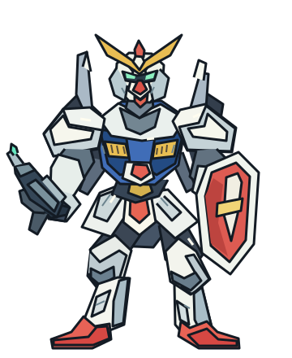

# 星尘防线：宇宙很大，驾驶舱有点挤

> 「报告舰桥，我看到了地球。」
>
> 「很好。也请看看你面前那四台正在瞄准你的敌机。」

一份高达风格的原创宇宙机甲任务档案，附带一款可离线游玩的回合制网页战棋。机体、角色和战役均为原创，非官方作品，不使用官方素材。

## 01 / 出击入口

[**进入驾驶舱，开始出击 →**](./index.html)

用浏览器打开同目录的 **index.html** 即可离线游玩。请保留整个 `cosmic-mecha` 文件夹及其目录结构，让脚本和插画都能随舰出发。不需要安装、不需要注册，也不需要等待粒子引擎预热。

| 文件 | 舰上职责 |
| --- | --- |
| `index.html` | 游戏入口 |
| `style.css`、`battle.css` | 驾驶舱布局与战场样式 |
| `game.js` | 回合、战斗与键盘操作 |
| `effects.js` | 战斗反馈与可选音效 |
| `assets/stardust.svg`、`assets/lunar-orbit.svg` | 原创机体与月球轨道插画 |
| `assets/LICENSE-icons.txt` | 界面图标许可说明 |
| `星尘防线.md`、`game.test.cjs` | 本任务档案与规则测试 |

手机触摸和桌面鼠标均可操作。键盘驾驶员可先按 **Tab** 进入棋盘，用**方向键**移动光标，按 **Enter 或空格**锁定格子，再按 **Tab** 移到可用的战术按钮并执行。

音效默认关闭，可点击页面右上角的扬声器按钮开启或关闭。音效由浏览器本地合成；静音也能完成整场任务。**刷新页面或重新开始都会重置战局，没有自动保存。**

这是一场短篇回合制战术遭遇战。剧情里的黎明很紧迫，游戏里没有倒计时：你可以先喝完咖啡，再下达指令。

## 02 / 今天的宇宙，不太和平

轨道历 0087 年，月球背面。

殖民卫星「灯塔七号」正经历一年一度的人工日出维护。按计划，四分钟后，镜阵会把第一缕阳光送进居民区。

但雷达上多了四个红点。

守备舰队尚在远侧轨道，能立即出击的只有试验机 **RX-SD / 01「星尘号」**。驾驶员是你。陪你值班的是舰载 AI「小七」，一个精通弹道计算、但坚持把维修费算进战绩的系统。

你的任务只有一条：**让这座城市照常迎来早晨。**

敌方指挥机发来公开通讯：「投降吧，你只有一台机体。」

小七建议回复：「你们只有四台，维修预算够吗？」

## 03 / 机体说明书：没有附赠主角光环

**RX-SD / 01「星尘号」**：白色主装甲、蓝色胸甲、金色传感器天线。设计师把浪漫装进了外观，工程师把余额写在了能源表上。



| 系统 | 参数 | 小七的备注 |
| --- | --- | --- |
| 装甲 | 100 | 不能回血。不要用脸测试敌人的瞄准精度。 |
| 粒子能源 | 100 | 光束步枪不是无限续杯。 |
| 光束步枪 | 40 伤害 / 消耗 30 能源 | 普通敌机一发，指挥机两发。 |
| 推进器 | 每次移动距离最多 2 | 距离按横向格数加纵向格数计算。 |
| 武器射程 | 距离最多 4 | 隔着空域照样命中，没有随机命中率。 |
| 防御充能 | 回复 35 能源，上限 100 | 本回合每个敌人的攻击降为 2 点。 |

## 04 / 三条指令，决定一个清晨

战场是 **8 列 × 6 行** 的空域网格，横向为 A–H，纵向为 1–6。星尘号从 **C6** 出发。所有距离都按横向格数加纵向格数计算，例如 C6 到 D5 的距离是 2。

1. **推进移动**：先选择一个没有机体的格子，再点击移动。只能选择距离 1–2 的目的地；移动按目的地判定，不检查途中格子。
2. **光束射击**：先选择敌机，再点击射击。距离不超过 4 且能源不少于 30 时可用。
3. **防御充能**：无需选择目标。立即补充能源，并降低随后敌方回合的伤害。

每执行一次有效指令，所有存活敌机立即各行动一次：距离你不超过 3 的敌机会开火，其他敌机向你靠近一格。移动后的敌机不会在同一回合开火。

普通敌机有 40 装甲，每次攻击造成 8 点伤害；紫电指挥机有 80 装甲，每次攻击造成 12 点伤害。消灭全部四台敌机即获胜，装甲归零则任务失败。页面右上角的重新开始按钮可以重置战局。

**小七的能源账本：** 三台普通敌机各需一发，指挥机需要两发，合计五发、150 点能源。初始只有 100 点，因此至少要充能两次。能源接近满格时充能会浪费溢出部分；只防御也会持续损失装甲。

**战术便签：** 你的射程比敌方多一格，可以在距离 4 时先手开火。优先消灭普通敌机能减少后续集火；指挥机虽显眼，但不是每次都值得先打。防御充能不修复装甲，别把它当急救包。

<details>
<summary>打开小七的战术信封：一条完整通关路线（含剧透）</summary>

从全新战局开始，按下表依次行动。装甲和能源是该指令及随后敌方行动全部结束后的数值。

| 步骤 | 你的指令 | 装甲 / 能源 | 小七批注 |
| --- | --- | --- | --- |
| 1 | 移动到 C4 | 100 / 100 | 先占据射击位置。 |
| 2 | 射击 C1 的赤隼一号 | 100 / 70 | 第一台退场，指挥机会移到 C1。 |
| 3 | 射击 F3 的赤隼三号 | 88 / 40 | 抢先清除侧翼目标。 |
| 4 | 射击 C1 的紫电指挥机 | 76 / 10 | 它还剩 40 装甲，你需要充能。 |
| 5 | 防御充能 | 72 / 45 | 两台敌机各打 2 点，护盾值班。 |
| 6 | 再次射击 C1 的紫电指挥机 | 64 / 15 | 紫色喷漆不能增加装甲。 |
| 7 | 防御充能 | 62 / 50 | 为最后一发准备能源。 |
| 8 | 射击 D2 的赤隼二号 | 62 / 20 | 四台清空，黎明准时抵达。 |

这套路线按当前游戏逻辑验证可获胜，剩余装甲 62、能源 20。它不是唯一解，也不宣称是最优解。你能让维修账单更短吗？

</details>

## 05 / 舰载 AI 值班记录

```text
04:51  驾驶员：宇宙里为什么没有声音？
04:51  小七：因为是真空。但你的装甲告警可以有。
04:52  驾驶员：能把告警换成轻音乐吗？
04:52  小七：可以，曲目名《左肩维修报价单》。
04:53  驾驶员：那台紫色的，是王牌吗？
04:53  小七：至少喷漆预算是你的三倍。
04:54  舰桥：请停止闲聊，准备接敌。
04:54  小七：已将闲聊重新分类为驾驶员心理稳定程序。
```

## 06 / 小七的科学审稿：哪些是真的？

| 话题 | 现实科学 | 本作的虚构与简化 |
| --- | --- | --- |
| 宇宙里能听见爆炸吗？ | 真空不能传播普通声波；机体内部仍可通过空气或结构传声。 | 舰桥通讯和装甲告警发生在驾驶舱里，战场对白服务于故事。 |
| 机甲转身就能拐弯吗？ | 姿态与运动方向不同。改变速度需要力；关闭推进器不代表立刻停下。 | 网格移动即时完成，不模拟惯性、燃料和轨道力学。 |
| 月球背面永远是黑的吗？ | 月背也经历昼夜；“背面”指长期背向地球的一侧，不是永夜区。 | “灯塔七号”、轨道历和镜阵日出维护都是原创设定。 |
| 光束会像彩色长剑一样可见吗？ | 没有散射介质的真空中，通常不能从侧面看见完整激光束。 | 光束武器、粒子护盾和边防御边充能是游戏规则，不代表现有技术。 |

> 小七：物理学没有禁止你喜欢巨大机器人。它只是会在工程评审时多问几句。

## 07 / 通关之后

港灯逐盏亮起，城市的第一班电车准时发车。

没有人知道你刚才还在计算最后 30 点能源够不够用。早餐店老板只是在收音机里听见一句：「外部空域管制解除。」

小七关闭了火控系统。

> 「任务完成。顺便说一句，你那杯咖啡已经绕太阳飞了很长一段路。」

**宇宙里最值得守护的，也许就是别人平凡的一天。**

### 驾驶员的下次挑战

- **维修部满意奖**：通关时保留超过 62 点装甲。
- **换条航线**：第一次移动不去 C4，找出另一种获胜路线。
- **编剧席位**：给小七写一句胜利台词，唯一限制是不能再提咖啡报销。

这些是你可以自行记录的小挑战，网页不另设成就系统。

---

实现：原生 HTML / CSS / JavaScript，原创 SVG 机体与宇宙插画、浏览器本地合成音效，无运行时外部依赖、无联网请求、无数据上传。界面使用 Lucide 图标，许可见 `assets/LICENSE-icons.txt`。此作品仅为高达风格同人娱乐创作，与相关权利方无关联。
