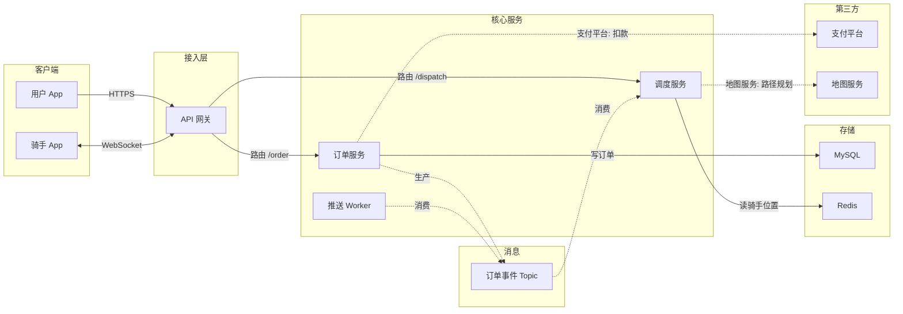

# 软件架构图

适用：用户要一张**软件架构图**——展示服务、数据存储、消息队列、外部集成及其连接关系。它本质上是 flowchart，但由专用的**网格分层布局**（不是 ELK）绘制，通过 `generate_diagram` 的 `useArchitectureLayoutCode` 参数启用。

决策树、业务流程、依赖图等通用流程图请读 [flowchart.md](flowchart.md)。

## 目录

1. 动笔之前
2. 规则（硬性规则 / 正确性规则 / 允许的连线 / 已知坑）
3. 子图分类与常见归类歧义
4. async 子图
5. 节点粒度
6. 连线类型
7. 校验清单
8. Mermaid 语法规则
9. 完整示例
10. 调用参数

---

## 1. 动笔之前

- **不要编造服务或连线。** 用户只说“我们有几个微服务”时，先用 `ask_user` 问 1～2 个聚焦问题（有哪些服务？各自读写什么存储？用了哪些第三方？）。真实但不完整的图，比精美但虚构的图有用。
- 真相在代码或文档里时，先读再画：用 `file_grep` 搜路由注册、HTTP handler、消息消费者、数据库连接配置、第三方 SDK 初始化，按真实调用关系连线。

## 2. 规则

写 Mermaid 前先读这里；写完后再用第 7 节“校验清单”复查一遍。规则分两档：

- **必须 / 禁止**：违反会导致工具报错、渲染崩溃，或静默画错且难以察觉。
- **应当 / 不应**：能渲染，但结构错误或误导读者。

### 硬性规则（必须）

1. **只能用 `flowchart LR`。** 专用布局只支持从左到右，`TD`/`TB` 不支持。
2. **每个节点都必须放在某个子图内。** 子图外的节点没有层级归属，布局无法放置。颜色和形状由子图归属自动分配，不需要写 `classDef`、`class`、`style`。
3. **子图 ID 只能是以下六个之一：** `client`、`gateway`、`service`、`datastore`、`external`、`async`。布局靠这些 ID 摆放泳道，其他 ID 会破坏布局。给人看的标题写在方括号标签里：
   - 错：`subgraph 后端服务`、`subgraph Services`
   - 对：`subgraph service ["后端服务"]`
4. **正向边和双向边在 `client → gateway → service → datastore` 之间必须构成有向无环图（DAG）。** 出现环会导致工具报错；任何“往回流”的关系改用反向边（规则 8）。
5. **凡是触及 `async` 或 `external` 节点的边，无论方向，都必须用点线 `-.->`。** 渲染器靠点线来区分异步/外部路径的路由方式。

### 正确性规则（应当）

6. **一个节点 = 一个可独立部署的单元。** 不要把一个服务拆成内部模块（见第 5 节）。
7. **双向边按正向书写**：写 `client节点 <-->|"WebSocket"| gateway节点`，不要反过来写。布局以源节点位置锚定这条边。
8. **反向边用 `<---`，且左侧节点写在前**，箭头指向左边。例如 `billing <---|"退款回调"| payment` 表示退款从 `payment` 流回 `billing`。
9. **不要把边连到子图 ID 上。** 子图只是容器，无法作为锚点；连到子图里的具体节点。
10. **同一对节点之间不要出现两条边。** 渲染器可能重叠或丢弃重复边；合并成一条并合并标签。
11. **双向意图只用一条 `<-->`**，不要拆成 `-->` 加 `-.->` 两条。

### 允许的连线

每条边都必须能在下表找到对应的“源 → 目标”行；表里没有的就是错的，通常需要插入一个 `service` 来中转。

| 源 | 目标 | 语法 | 用途 |
|---|---|---|---|
| `client` | `gateway` | `-->` | HTTPS、GraphQL |
| `client` | `gateway` | `<-->` | WebSocket 等实时双向 |
| `gateway` | `service` | `-->` | 路由、反向代理 |
| `service` | `service` | `-->` | 内部 RPC、微服务调用 |
| `service` | `service` | `<-->` | gRPC 流、双向内部通道 |
| `service` | `service` | `<---` | 反向：回调、缓存失效、退款（左侧节点写在前） |
| `service` | `datastore` | `-->` | 读、写、查询 |
| `service` | `async` | `-.->` | 生产事件（消费者订阅也可写成此方向，标签写“消费”） |
| `async` | `service` | `-.->` | 投递、扇出给消费者 |
| `service` | `external` | `-.->` | 调第三方 API，标签格式 `"服务名: 用途"` |

**常见错误**（都不在上表中，遇到就重构）：

- `client` 连到 `gateway` 以外的任何东西（必须经网关）。
- `gateway` 直连 `datastore`、`async` 或 `external`（必须经某个 service）。
- 两个 `datastore` 之间、两个 `async` 之间、`datastore` 与 `async` 之间直连（任何方向都不行）。
- `external` 连到 `service` 以外的节点，或两个 `external` 直连。
- 边的端点是子图 ID。

两个改写示例（用自己的场景）：

```
错：eventBus -.-> mailQueue
对：dispatcher -.->|"订阅"| eventBus   再加   dispatcher -.->|"投递邮件任务"| mailQueue

错：edge -.-> sms
对：edge --> notice   再加   notice -.->|"短信平台: 发送验证码"| sms
```

### 已知坑

- **双向异步 `<-.->` 不被支持**，会静默退化成单向 `-.->`。需要双向异步时，拆成两条方向相反、标签不同的 `-.->`（例如“生产”和“消费”）。

## 3. 子图分类

布局顺序：`client` → `gateway` → `service` → `datastore`；`external` 放在最右侧、与 `datastore` 泳道并列；`async` 放在 service + datastore 泳道的上方或下方。颜色与形状自动分配，所有节点都用普通的 `[文本]` 写法。

| 子图 ID | 放什么 |
|---|---|
| `client` | Web/移动/桌面应用、CLI、终端用户 |
| `gateway` | CDN、负载均衡、API 网关、反向代理 |
| `service` | 微服务、单体应用、Serverless 函数、ETL、异步 worker、定时任务 |
| `datastore` | 数据库、缓存、对象存储（MySQL、PostgreSQL、Redis、OSS/S3、Elasticsearch） |
| `external` | 功能开关、监控、支付、OAuth、第三方 SaaS |
| `async` | 消息基础设施：Kafka、RabbitMQ、RocketMQ、SQS、Pub/Sub、Redis Streams |

### 常见归类歧义

一个节点可能属于两类时按下面默认处理，仍拿不准就问用户：

- **CDN（CloudFront、Cloudflare、阿里云 CDN 等）**：图里讨论你们自己的路由配置时归 `gateway`；只是“我们用了某 CDN”没有路由细节时归 `external`。
- **Lambda / 云函数**：归 `service`。独立部署的一个函数算一个节点，否则合并为一个逻辑服务。
- **支付平台的 Webhook**：支付平台本身归 `external`；你们接收 Webhook 的队列归 `async`。
- **第三方监控（Datadog、Sentry 等）**：归 `external`，它们接收数据但不在请求链路里。
- **只读副本、分片库**：画成一个 `datastore` 节点，除非本次流程确实分别访问它们。
- **消费者 worker**：归 `service`，绝不归 `async`（队列是基础设施，消费它的 worker 是服务）。
- **数据库复制机制（WAL、binlog、CDC）**：省略，或在 `datastore` 节点出发的点线标签里体现；它们不能独立部署，不单独成节点。

## 4. async 子图

**async 节点 = 可独立部署的消息基础设施。** 以下不属于 `async`：

- 消费者 worker → `service`
- 数据库复制机制 → 省略或写成标签
- 同一个 broker 的逻辑拆分（多个 topic）→ 仍画成一个节点

标准模式：`生产者服务 -.->|"生产"| 队列`，`队列 -.->|"消费"| 消费者服务`。

## 5. 节点粒度

自问：“这个东西能单独部署、重启或扩缩容吗？”能 → 画成节点；不能 → 不画。

## 6. 连线类型

| 类别 | 语法 | 用途 |
|---|---|---|
| 正向 | `-->` | 常规从左到右的数据流 |
| 双向 | `<-->` | WebSocket、gRPC 流（按正向书写） |
| 反向 | `<---` | 回流、缓存失效（左侧节点写在前） |
| 异步/外部 | `-.->` | 任何触及 async 或 external 节点的边 |

**选边方法**：确定源、目标所在子图 → 在“允许的连线”表中找到对应行 → 用该行语法。找不到就说明这条边不合法，通常需要插入一个 service 中转。

> 外部边会渲染到 external 区域的边框处，标签里务必写明服务名：`"服务名: 用途"`。

### 最佳实践（风格建议，违反不致结构错误）

1. **一张图一个主题**，聚焦用户问的那条链路。
2. **边数控制在 15～20 条以内**，与本次主题无关的边省略。
3. **跨子图的边都要加标签**：源节点视角的动词，必要时带具体对象（“读用户”“写订单”“生产”），1～4 个词。

## 7. 校验清单（写完、调用前逐条走一遍）

1. **正向边与双向边构成 DAG**：会成环的那条改为反向边 `<---`。
2. **每个 service 都有输入和输出**：对每个服务问“数据从哪来？”“结果送到哪？”，缺一个就是漏边，或者这个节点不该存在。
3. **逐个列出 service 节点检查**：确认每个都至少有一条入边和一条出边，发现缺口先补齐。
4. 附加检查（来自上文规则）：所有节点都在六个合法子图 ID 内；触及 async/external 的边全是点线；没有连到子图 ID 的边；同一对节点没有重复边；没有 `<-.->`；主方向是 `flowchart LR`；没有 `classDef`/`style`。

## 8. Mermaid 语法规则

1. 节点 ID 用 camelCase，不含空格和**下划线**（`userService`，不要 `user service` 或 `user_service`）。此布局内部会按 `_` 切分 ID，下划线会破坏连线路由。
2. 含特殊字符的节点标签用双引号：`cfg["配置中心 (Nacos)"]`。
3. 含特殊字符的边标签用双引号：`-->|"读 (只读副本)"|`。
4. 不要用 `end`、`subgraph`、`graph` 作为节点 ID。
5. 标签里不要有 HTML 标签或 emoji。

## 9. 完整示例

一个外卖平台的下单链路：



## 10. 调用参数

- `name`：描述性的图名
- `mermaidSyntax`：遵守上述全部规则的 Mermaid
- `useArchitectureLayoutCode`：`"FIGMA_DIAGRAM_2026"`（以 tools/list 返回的 schema 描述为准，若说明中给出不同的值则以其为准）
- `userIntent`（可选）：用户目标
