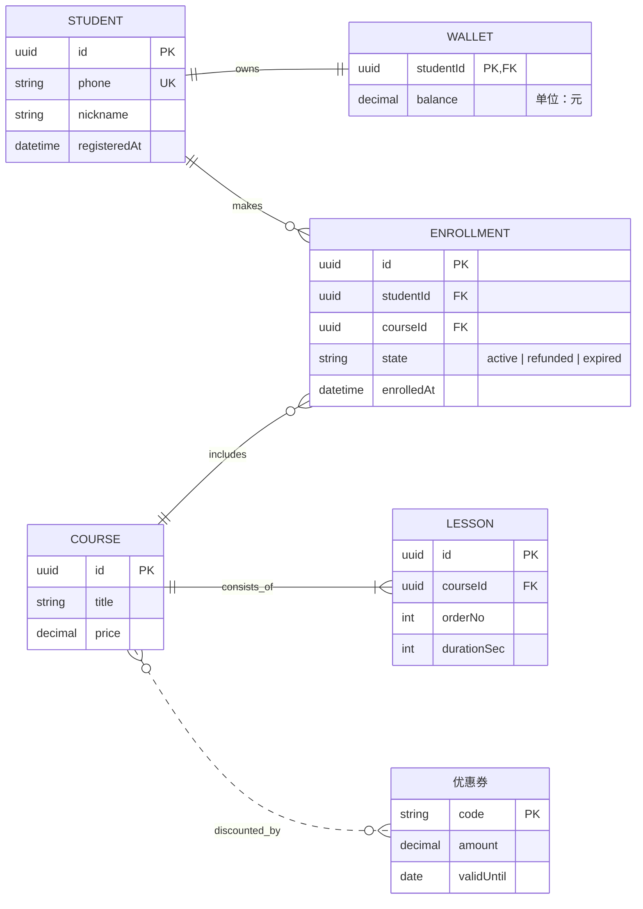

# ER 图（实体关系图）

适用：数据模型——实体（表）、属性（列）以及实体之间的关系（外键、基数）。

典型题材：数据库 schema、领域模型、API 资源引用关系、数据湖结构，凡是重点在“这些实体以什么方式相互关联、各有哪些字段”的图。

服务之间的静态架构（不是数据）→ [architecture.md](architecture.md)；单个实体的状态机 → [state.md](state.md)。

## 目录

1. 什么时候用 ER 图
2. 最小骨架
3. 实体
4. 属性
5. 关系
6. 方向
7. 不支持的写法
8. 布局
9. 混合工作流
10. 最佳实践
11. 校验清单
12. 完整示例
13. 调用参数

---

## 1. 什么时候用 ER 图

合适：数据库 schema（表 + 列 + 外键）；领域模型（用户/账户/订阅/订单之类）；API 资源图；解释 1:N、N:M 的规范化数据模型文档；从现有数据库逆向整理出来、用于设计评审的模型。

不合适（改选类型）：服务/队列/存储之间的连接 → 架构图；流程与判断 → 流程图；时间线/排期 → 甘特图；多方随时间的交互 → 时序图；单个实体的生命周期 → 状态图。

## 2. 最小骨架

```
erDiagram
    AUTHOR ||--o{ ARTICLE : writes
    ARTICLE ||--o{ COMMENT : receives

    AUTHOR {
        string penName
        string email
    }
    ARTICLE {
        string title
        datetime publishedAt
    }
```

必须有：第 1 行 `erDiagram` 关键字，以及至少一个实体。关系在语法上可选，但通常是整张图的重点。

## 3. 实体

三种声明形式：

- **只有名字**：`TAG` —— 渲染成普通矩形（无属性）。
- **带属性**：`TAG { string slug }` —— 在 FigJam 中渲染为**表格**：表头是实体名，每个属性一行。没有属性的实体仍是矩形。两种可以混用：已细化的实体画成表格，尚未细化的高层概念画成矩形。
- **带显示别名**：`TAG["文章标签"]` —— 渲染的是方括号里的别名，左侧 ID（`TAG`）用于在关系中引用。

### 坑：关系行里不能写别名

下面这种写法**无法解析**：

```
AUTHOR["作者"] ||--o{ ARTICLE["文章"] : writes
```

正确做法：别名只写在实体声明块上，关系行里用纯 ID：

```
AUTHOR["作者"] {
    string email
}
ARTICLE["文章"] {
    string title
}
AUTHOR ||--o{ ARTICLE : writes
```

## 4. 属性

格式：`类型 名称 [键] ["注释"]`

```
ARTICLE {
    uuid id PK
    string slug UK
    uuid authorId FK
    string coverUrl "可为空"
    int viewCount
    string legacyId PK, UK "旧系统主键"
}
```

- **类型**：自由文本，Mermaid 不校验。常用 `string`、`int`、`float`、`decimal`、`bool`、`date`、`datetime`、`uuid`、`json`、`text`。同一张图里选定一套写法并保持一致。
- **键**：`PK` 主键、`FK` 外键、`UK` 唯一键；一个属性可有多个键，用逗号分隔：`PK, FK`。键在表格里渲染为属性名旁的小徽标。
- **注释**：可选，放在行尾双引号里，写简短说明（“可为空”“软删除”“按创建时间建索引”）。

## 5. 关系

格式：`实体A <基数对> 实体B : 标签`

- 左侧实体为 A 端，右侧为 B 端。
- 标签是从 A 视角出发的短动词短语。

### 基数对

每一侧符号描述**靠近它的那个实体**参与的数量。

| 写法 | 含义 | 例子 |
|---|---|---|
| `\|\|--\|\|` | 恰好一 ↔ 恰好一 | 必选 1:1（用户 ↔ 实名信息） |
| `\|\|--o\|` | 恰好一 ↔ 零或一 | 可选 1:1 |
| `\|\|--o{` | 恰好一 ↔ 零或多 | 经典 1:N（作者 → 文章） |
| `\|\|--\|{` | 恰好一 ↔ 一或多 | 子项必存在的 1:N（订单 → 订单行） |
| `}o--o{` | 零或多 ↔ 零或多 | 可选 N:M |
| `}\|--\|{` | 一或多 ↔ 一或多 | 双方必选的 N:M |

### 标识关系 vs 非标识关系

- `--`（双横线）= **标识关系**，渲染为**实线**：子实体离开父实体就无法存在。
- `..`（双点）= **非标识关系**，渲染为**点线**：较弱或可选的关系。

```
INVOICE ||--|{ INVOICE_LINE : contains     %% 实线：发票行必须依附发票
ARTICLE }o..o{ TAG : tagged_with            %% 点线：可选的多对多
```

### 标签

A 视角的短动词：`writes`、`owns`、`contains`、`references`（中文也可：`撰写`、`拥有`）。1～3 个词，去掉冠词。允许不写标签，但不推荐——标签才是 ER 图传达含义的关键。标签含空格时用下划线连接或加引号。

## 6. 方向

可选：在 `erDiagram` 下一行写 `direction LR`（或 `TB`、`BT`、`RL`）。4～8 个实体的 schema 多数适合 `LR`；层级更深的适合 `TB`；不写则用 Mermaid 默认值。

## 7. 不支持的写法

- **样式**：`classDef`、`class X 样式名`、行内 `:::样式名`、`style X fill:...` 都会被静默丢弃（没有颜色）。与状态图不同，这些语句**不会**生成幽灵实体，只是不生效。需要配色走混合工作流（第 9 节）。
- **继承/子类型**：Mermaid 没有原生语法；画成普通 1:1，并在标签中注明（如 `is_a`）。
- **注释便签**：ER 图没有 `note`；需要标注走 `use_figma`。
- **关系行中的别名**：见第 3 节。

## 8. 布局（与流程图相同的 ELK）

ER 图同样由 ELK 分层布局渲染，[flowchart.md](flowchart.md) 第 5 节“ELK 布局应对”的原则同样适用：

- **简单环没问题**：小规模的循环外键（用户 → 团队 → 用户）不需要特殊处理。
- **规模越大越痛**：一张图 20 个以上实体就开始拥挤，按子域拆分（每个限界上下文一张）。
- **属性多的表会纵向拉长**，拖累整体布局；只保留最重要的 5～10 列。

## 9. 混合工作流：先 `generate_diagram`，再 `use_figma`

`generate_diagram` 能产出排好版的 ER 结构：带属性的表格、基数端点、关系连线。渲染器不支持的部分——按类别着色、注释、按业务域分区高亮、针对某一列的标注——都可以之后用 `use_figma` 叠加。

**当需求超出“表 + 关系”时的默认流程：**

1. **用 `generate_diagram` 搭骨架**：实体（有无属性均可）、关系、基数、标签。跳过会被丢弃的样式。
2. **用 `use_figma` 扩展**（同一个 `fileKey`）：
   - 在特定实体、列或关系旁添加便签/文字**注释**；
   - 在一组实体后方放背景矩形，表示**业务域分组**（账号域 / 计费域 / 内容域）；
   - 按类别**着色**（核心表 / 字典表 / 关联表 / 审计表），可用垫在表格后的矩形实现；
   - 添加**序号或徽标**，表示迁移顺序、废弃状态等。

写入前先用 `skill_read` 加载 `figma-use` 技能，FigJam 操作再加载 `figma-use-figjam` 技能；写入用户文件前用 `ask_user` 确认。具体配方见 [workflow.md](workflow.md)。

**需要混合工作流的信号**：用户说“按域着色”“按业务分组”“标出已废弃的表”“给这一列加注释”“把核心表和审计表分开”；想区分实体角色（事实表 vs 维度表、只读 vs 可变、软删除 vs 已归档）；想在同一白板上放 schema 与迁移说明/决策记录。

**完全跳过 `generate_diagram` 的情况**：仅当基础布局没用时——例如用户要放射状 schema 图、Visio 风格的数据库地图、强风格化的幻灯片插图。这时直接用 `use_figma` 绘制。

**务实，不作秀**：需求具体就搭完骨架直接扩展；否则搭完骨架只追问一句：“基础 schema 已生成，需要按域着色 / 给软删除字段加注释 / 把审计表分组高亮吗？”

## 10. 最佳实践

1. **先定关系，再补属性**。基数正确比列全更重要。
2. **精简属性**：每个实体 5～10 列最合适，完整 schema 属于迁移文件或 DDL。
3. **键标记保持一致**：主键总是 `PK`，外键总是 `FK`——这是读者最常问的问题。
4. **有意识地选择 `--` 与 `..`**：必需的父子关系用实线，可选/弱关系用点线。
5. **一张图一个限界上下文**：40 个实体的全量 schema 没法读；账号、计费、内容分别画，共享实体处用简短标签说明。
6. **每条关系都写标签**。
7. **实体 ID 是 SQL 风格（`user_acct`）时用别名给出友好显示名**，但记住别名只能写在声明块上。

## 11. 校验清单（调用前）

1. 第 1 行是 `erDiagram`。
2. 每条关系都用第 5 节表中的合法基数对，并使用 `--` 或 `..`。
3. 关系中引用的实体都已声明（带或不带属性，或由关系行隐式声明——但不能带方括号别名）。
4. **关系行中没有别名写法**。
5. 属性类型写法前后一致（同一张图不要混用 `string`/`String`/`VARCHAR`）。
6. 键标记一致：`PK`、`FK`、`UK` 或逗号组合。
7. 没有 `classDef`、`class`、`:::`、`style` 行。
8. 实体数不超过约 15～20 个，否则按域拆分。

## 12. 完整示例

一个在线课程平台的数据模型，包含 1:1、1:N、N:M，实线与点线关系，键、注释以及一个带别名的实体：



## 13. 调用参数

- `name`：描述性的图名
- `mermaidSyntax`：ER 图源码
- `userIntent`：用户目标
- **不要**传 `useArchitectureLayoutCode`（仅架构图使用）
