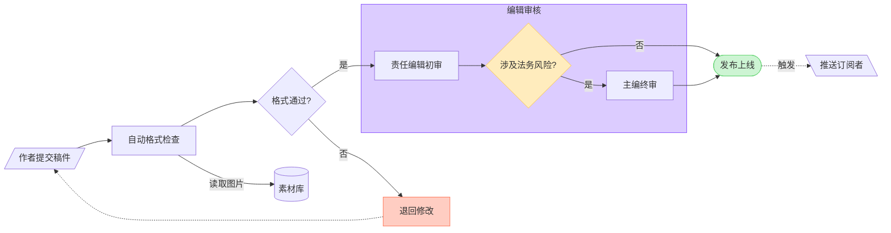

# 通用流程图（非架构图）

适用：决策树、业务流程、流水线、依赖关系图、用户路径等**不是**软件架构的流程图。软件架构（服务/存储/队列/外部集成）请改读 [architecture.md](architecture.md)。

这类图由 ELK（Eclipse Layout Kernel）做正交分层布局。下面的规则用于让图易读、用好 FigJam 的形状，并避开 ELK 容易出问题的布局。

## 目录

1. 方向
2. 形状
3. 连线
4. 子图（subgraph）
5. ELK 布局应对
6. 配色
7. 文字质量
8. 密度与拆分
9. 校验清单
10. 完整示例
11. 什么时候不该用流程图
12. 调用参数

---

## 1. 方向：动笔前定好，全图只用一个

- `flowchart LR`：**默认**。适合顺序流程、流水线、依赖链、2～3 层的决策树。
- `flowchart TD`（或 `TB`）：层级结构、分类树、深而窄的树，或同一层兄弟节点很多时使用，可控制宽度。

不要在图中途改主方向。

## 2. 形状：有含义才用，不要堆砌

Mermaid 支持很多形状名，但大部分在 FigJam 里会退化为普通矩形。只有下表中的形状会渲染成 FigJam 里独立的形状：

| 简写 | `@{shape: ...}` 写法 | 渲染结果 | 用途 |
|---|---|---|---|
| `a[文本]` | `rect` / `square` | 矩形 | 普通步骤（默认） |
| `a(文本)` | `rounded` | 圆角矩形 | 较“软”的步骤 |
| `a([文本])` | `stadium` | 胶囊形 | 流程开始/结束 |
| `a((文本))` | `circle` | 椭圆 | 入口/出口、事件 |
| `a{文本}` | `diamond` | 菱形 | **判断/分支** |
| `a{{文本}}` | `hexagon` / `hex` | 六边形 | 准备、初始化、交接 |
| `a[[文本]]` | `subroutine` | 预定义过程 | 调用子流程/函数 |
| `a[(文本)]` | `cylinder` / `cyl` | 数据库圆柱 | 任意数据存储 |
| `a[/文本/]` | `lean-r` | 右斜平行四边形 | 输入 |
| `a[\文本\]` | `lean-l` | 左斜平行四边形 | 输出 |
| `a[/文本\]` | `trap-t` | 梯形 | 人工操作 |
| `a[\文本/]` | `trap-b` | 倒梯形 | 人工操作（反向） |
| `a>文本]` | `odd` | 旗形/箭头形 | 标记、标签 |
| — | `doc` | 文档 | 文件、报告、产物 |
| — | `docs` | 多文档 | 文件集合 |
| — | `tri` | 正三角 | 层级根、警示 |
| — | `flip-tri` | 倒三角 | 反向层级 |
| — | `notch-pent` | 五边形 | 里程碑、状态 |
| — | `comment` | 对话气泡 | 注释 |
| — | `cross-circ` | 汇合符号 | 合并、汇总 |

`@{shape: ...}` 写法示例：`report@{shape: doc, label: "周报"}`。

**解析器接受但会渲染成普通矩形的形状**（不要指望它们区分视觉）：`text`、`notch-rect`、`lin-rect`、`fork`、`hourglass`、`brace-r`、`braces`、`bolt`、`delay`、`das`、`curv-trap`、`div-rect`、`win-pane`、`sl-rect`、`processes`、`flag`、`bow-rect`、`tag-rect`、`subproc`。

### 形状已表达的含义不要在文字里重复

- 差：`store[(数据库：MySQL)]` → 好：`store[(MySQL)]`
- 差：`q{判断：库存充足?}` → 好：`q{库存充足?}`

全是矩形虽然朴素但往往是对的；满屏花哨形状反而干扰阅读。拿不准就用矩形。

## 3. 连线：线型、端点、标签

### 线型

| 语法 | FigJam 线型 | 用途 |
|---|---|---|
| `a --> b` | 实线 | 默认的数据/控制流 |
| `a -.-> b` | 点线 | 异步、条件、可选、“稍后发生” |
| `a ==> b` | 粗线 | 关键路径、强调 |

### 端点

| 语法 | 端点 | 用途 |
|---|---|---|
| `a --> b` | 箭头 | 默认 |
| `a --o b` | 圆点 | 组合、“止于” |
| `a --x b` | 叉 | 终止、错误、阻断 |
| `a --- b` | 无 | 仅表示关联 |

双端：`a <--> b`（双向，按正向书写）、`a o--o b`（两端圆点）、`a x--x b`（两端叉）。

### 标签

写法：`a -->|"标签"| b`，有特殊字符必须加引号。

- 1～4 个词，从**起点**视角描述动作（“写入”“校验”“返回 401”）。
- 末尾不加句号，不用 emoji。
- 显而易见的连线可以不加标签。

### 反向连线

ELK 按从左到右（或从上到下）分层，反向连线会绕开已有节点，通常很乱。两种处理：

1. 反写语法：`b <-- a`（左边的节点写在前，箭头朝左），ELK 仍会绕行，但标注正确。
2. 若反向指向的是一个被多处引用的共享节点，**优先复制该节点**（见第 5 节）。

### 扇出/扇入简写

`&` 可以一次连多个节点：

```
intake --> triage & archive & notify     %% 一对多
web & app & mini --> gateway             %% 多对一
a & b --> c & d                          %% 多对多
```

列表短且含义清楚时使用；需要各自标签或数量较多时，逐条写更清楚。

### 注释

`%% 文本` 是注释，渲染时忽略。长图中可用来分段标记，便于后续维护，但不要滥用——用户通常不会读 Mermaid 源码。

## 4. 子图：把相关节点编组

```
subgraph review ["评审阶段"]
    draft[起草]
    peer[同行评审]
    signoff[负责人签字]
end
```

### 何时使用

- 有清晰的逻辑边界（子系统、阶段、团队归属）。
- 3 个及以上相关节点共享同一输入或输出。
- 只有两个节点时不值得用子图。

### 跨子图连线

布局启用了 `elk.hierarchyHandling: INCLUDE_CHILDREN`，子图内节点可以直接连到另一个子图内的节点或顶层节点，路由仍是正交的。

**始终连到具体节点**。连到子图 ID（如 `review --> publish`）虽然能解析，但路由不可预测。

### 嵌套

支持嵌套，但最多 2 层；更深会挤压标签并干扰 ELK 的间距。

### 给子图加浅色底，让它从画布中凸显

FigJam 画布接近白色，不加样式的子图只有一条细边框，容易和点阵背景混在一起。给每个子图一个浅色填充：

```
style review fill:#DCCCFF,stroke:#874FFF
style launch fill:#CDF4D3,stroke:#66D575
```

- 用柔和的浅色，不要饱和色；多个子图各用不同浅色；只有一个子图时，`#F5F5F5` 填充 + 深一点的描边通常就够。
- 子图是容器，样式不要压过里面的节点。

### 子图内单独设置方向

```
flowchart LR
    subgraph steps ["上线步骤"]
        direction TB
        s1[灰度 5%] --> s2[灰度 50%] --> s3[全量]
    end
```

少用，混合方向容易让读者迷失。

## 5. ELK 布局应对

ELK 比想象中能干：小中型图（带一个回环的线性流程、几个服务汇入一处、一条长的重试回路、几条跨子图连线）直接就能画好。**不要预先为了“规避”而扭曲 Mermaid**。

下面的手段只在渲染结果**确实**出现明显交叉、长马蹄形绕线、子图拥挤时才用。另外，FigJam 渲染器偶尔会重算坐标，覆盖 ELK 的拐点，轻微的异常不一定是 Mermaid 写错了。

### 环

真实存在的环就画出来：重试、重新打开、状态回退都可以。单个环（哪怕从末尾绕回开头）通常渲染良好。只有在已经很密的区域里**多个环缠绕同一批节点**时，才考虑拆图或复制共享节点。

### 扇入过多时复制共享节点

一个共享节点有约 5 条以内的入边时渲染很干净，**不要预先复制**。以下情况才值得复制：

- 大约 6 条以上入边汇聚到同一节点，箭头在目标处堆叠。
- 共享节点与部分来源相隔很多层，产生横穿其他内容的长连线。
- 入边横穿其他子图或流程，遮挡了它们。

做法（仅当扇入确实导致问题时）：

```
%% 改前：多个步骤都连到同一个“审计日志”
create --> audit
update --> audit
remove --> audit
%% ……还有更多

%% 改后：每个来源各自连一个同名节点
create --> auditA[审计日志]
update --> auditB[审计日志]
remove --> auditC[审计日志]
```

读者看到重复的“审计日志”会理解为同一个概念。可读性优先于节点数最少，但前提是可读性确实受损。

### 平衡各层

某一层 20 个节点、相邻层各 2 个时，ELK 会把宽层横向铺开，整张图变成细长条。拆图或用子图重新聚类。

### 避免空的或只有一个子节点的子图

徒占空间、增加噪声。

### 自环

支持（`a --> a`），周围留出空间；密集排列的自环会很别扭。

### 渲染不理想时的修正顺序

1. **拆图**：这真的是一张图吗？
2. **复制**混乱区域中被引用最多的节点。
3. **增加或收紧子图**，把相关节点聚在一起。
4. **切换方向**（LR ↔ TD），当宽高比与内容不匹配时。

## 6. 配色：少用，且要有语义

```
style risk fill:#FFCDC2,stroke:#FF7556
```

或用 classDef：

```
classDef done fill:#CDF4D3,stroke:#66D575
class s1,s2 done
```

只有 `fill` 和 `stroke` 生效；字号、线宽、虚线等其他属性会被忽略。

**颜色用于表达含义**：状态（绿=成功、红=错误、黄/橙=警告）、归属（A 团队 vs B 团队）、不适合用子图时的子系统分组。

**不要**：给每个节点都上色；使用高饱和色（与 FigJam 中性画布冲突）；只靠颜色传达信息（去掉颜色后形状和文字仍应能读懂）。

推荐浅色填充 + 同色系深描边。下表是 FigJam 内置调色板（与 FigJam 原生形状预设一致），可作为默认值；也可以用其他色值。

**浅色填充（深色文字 `#1E1E1E`）**

| 名称 | 填充 | 描边 | 常见用途 |
|---|---|---|---|
| 浅绿 | `#CDF4D3` | `#66D575` | 成功、完成、通过 |
| 浅青 | `#C6FAF6` | `#5AD8CC` | 次要成功、信息 |
| 浅蓝 | `#C2E5FF` | `#3DADFF` | 中性强调、焦点 |
| 浅紫 | `#DCCCFF` | `#874FFF` | 特殊、标注 |
| 浅粉 | `#FFC2EC` | `#F849C1` | 点缀、创意 |
| 浅红 | `#FFCDC2` | `#FF7556` | 错误、阻断、严重 |
| 浅橙 | `#FFE0C2` | `#FF9E42` | 警告、需关注 |
| 浅黄 | `#FFECBD` | `#FFC943` | 注意、待定 |
| 浅灰 | `#D9D9D9` | `#B3B3B3` | 弱化、废弃、背景信息 |

**饱和填充（强强调用；FigJam 原生会配白字，但 Mermaid 无法设文字颜色，标签多时优先用浅色）**

| 名称 | 填充 | 描边 |
|---|---|---|
| 绿 | `#66D575` | `#3E9B4B` |
| 蓝 | `#3DADFF` | `#007AD2` |
| 红 | `#FF7556` | `#DC3009` |
| 橙 | `#FF9E42` | `#EB7500` |
| 黄 | `#FFC943` | `#E8A302` |

## 7. 文字质量

- 节点标签：1～4 个词，名词短语或简短祈使句。
- 连线标签：1～4 个词，起点视角的动词。
- 不加句号、不用 emoji、不用 HTML 标签、不写 `\n`（ELK 按标签大小决定形状尺寸，长标签会拉伸形状）。
- 节点 ID 用 camelCase；避免下划线；避开 `end`、`subgraph`、`graph`。
- 含括号、冒号、斜杠等的标签加双引号。

## 8. 密度与拆分

- ≤ 约 20 个节点：通常没问题。
- 20～30：考虑用子图。
- 30 以上：拆成多张图。

拆分的理由：多个互不交互的阶段（每阶段一张）；不同受众（运维视角 vs 用户视角）；同一系统的不同场景（正常路径 vs 异常路径）。`generate_diagram` 可多次调用，一个 FigJam 文件放多张图是正常做法，给每张起不同的名字。

## 9. 校验清单（调用工具前逐条检查）

1. **环**：只在真实流程需要处出现；多个环缠绕同一批节点且区域很密时，拆图或复制共享节点。
2. **无孤立节点**：除明确的开始/结束节点外，每个节点至少有一条入边或出边。
3. **每个处理步骤有输入也有输出**：逐个节点检查，缺了就是漏了连线，或该节点本不该存在。
4. **标签**：不重复形状含义；连线标签为起点视角；不超过 4 个词；无句号、无 emoji。
5. **形状**：每个非矩形形状都有其意义；拿不准用矩形。
6. **颜色**：颜色有语义，否则不用；不是每个节点都上色。
7. **子图**：每个子图至少 3 个子节点且边界清晰；都用 `style` 加了浅色底。
8. **密度**：≤ 约 25 个节点，否则拆分。

## 10. 完整示例

一个内容发布流程，包含输入、判断、数据存储、子图、语义配色与回环：



## 11. 什么时候不该用流程图

回到 SKILL.md 改选类型：

- 多方随时间的交互 → 时序图（[sequence.md](sequence.md)）
- 数据模型/实体关系 → ER 图（[erd.md](erd.md)）
- 有明确状态与迁移的状态机 → 状态图（[state.md](state.md)）
- 带日期的项目排期 → 甘特图（[gantt.md](gantt.md)）
- 软件架构（服务、存储、队列）→ [architecture.md](architecture.md)
- 饼图、思维导图、韦恩图、类图、用户旅程、timeline、象限图 → `generate_diagram` 不支持，直接告诉用户

## 12. 调用参数

- `name`：描述性的图名
- `mermaidSyntax`：流程图源码
- `userIntent`（可选）：用户目标
- 通用流程图**不要**传 `useArchitectureLayoutCode`
