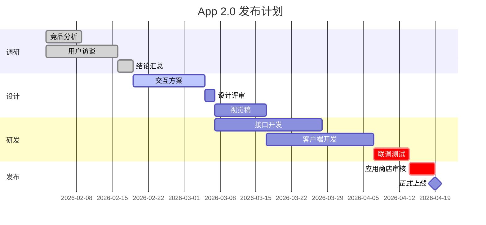

# 甘特图

适用：项目时间线、路线图、分阶段工作、迭代计划、发布日历——凡是主维度是**时间**、条目有开始时间、持续时长、可能依赖其他条目的图。

只是抽象的依赖关系（A 依赖 B）而没有具体日期时，用流程图（[flowchart.md](flowchart.md)）。甘特图是“时间在坐标轴上”。

## 目录

1. 什么时候用甘特图
2. 最小骨架
3. dateFormat
4. section 分区
5. 任务语法
6. 任务标签（状态）
7. 里程碑
8. 日内时间表
9. 不支持的写法
10. 限制与坑
11. 语法不够用时：用 use_figma 手工搭时间线
12. 最佳实践
13. 校验清单
14. 完整示例
15. 调用参数

---

## 1. 什么时候用甘特图

合适：跨季度/月份的产品路线图；通往发布的里程碑计划；1～4 周的迭代计划；单日或多日的活动议程。

不合适：无日期的依赖树 → 流程图；服务间调用顺序 → 时序图；状态机 → 状态图；数据模型 → ER 图。

## 2. 最小骨架

```
gantt
    title 新版官网改版
    dateFormat YYYY-MM-DD
    section 规划
    需求梳理        :req, 2026-03-02, 5d
    信息架构        :ia, after req, 4d
    section 实施
    页面开发        :dev, 2026-03-16, 2w
    上线准备        :prep, after dev, 3d
```

必须有：`gantt` 关键字、`dateFormat` 指令（按天及以上用 `YYYY-MM-DD`，日内用 `HH:mm`），以及至少一个有真实开始时间的任务。`title` 可选但强烈建议写。

## 3. dateFormat

只用两种可靠格式：

- `dateFormat YYYY-MM-DD`：默认，适用于天及以上粒度（迭代、路线图、发布计划）。
- `dateFormat HH:mm`：仅用于日内时间表，见第 8 节。

其他格式（`DD/MM/YYYY`、`MM-DD-YYYY`、完整日期时间）也许能解析，但会在预处理层出现意外结果，不要用。

## 4. section 分区

`section 分区名` 在渲染结果中是一条水平泳道，可按以下维度分组：阶段（调研/开发/发布）、团队或负责人（设计/研发/市场）、工作流（前端/后端/基础设施）。

`section` 之后的任务都属于该分区，直到下一个 `section`。任务很少时可以不分区，全部在一条泳道中。

## 5. 任务语法

标准形式：`任务名 :标签, ID, 开始, 时长或结束`

标签和 ID 可选；最少需要任务名、开始、时长/结束。开始可以是绝对日期，也可以是对其他任务的依赖。

| 形式 | 示例 | 何时使用 |
|---|---|---|
| 绝对开始 + 时长 | `启动会 :2026-03-02, 1d` | 简单条目 |
| 带 ID + 绝对开始 + 时长 | `启动会 :kick, 2026-03-02, 1d` | 之后要被其他任务引用 |
| 单依赖 + 时长 | `原型 :proto, after kick, 5d` | 在 `kick` 结束后开始 |
| 多依赖 + 时长 | `联调 :joint, after fe be, 1w` | 在 `fe`、`be` 中较晚结束者之后开始 |
| 显式结束日期 | `一期 :p1, 2026-03-02, 2026-04-10` | 两端都已知 |
| 里程碑 | `发布 :milestone, 2026-05-20, 0d` | 零时长标记 |

### 时长单位

`y`（年）、`M`（月，**大写 M**；小写 `m` 是分钟）、`w`（周）、`d`（天）、`h`（小时）、`m`（分钟）、`s`（秒）、`ms`（毫秒），可用小数（`1.5d`）。

路线图多用 `d`、`w`；跨多年用 `M`、`y`；`h`、`m` 仅用于日内图。

## 6. 任务标签（状态）

标签写在 ID/开始之前，用逗号分隔，可叠加多个（如 `:active, crit, t2, …`）。

| 标签 | 含义 | 用途 |
|---|---|---|
| `done` | 已完成 | 在前瞻性路线图中展示历史 |
| `active` | 进行中 | 当前正在做的一两项 |
| `crit` | 关键路径 | 真正会拖延整体的事项；滥用会失去意义 |
| `milestone` | 零时长标记 | 发布、关口、评审点 |

**不要**用 `vert` 标签（竖线标记）：解析器接受，但处理程序会故意跳过，该任务不会渲染。

## 7. 里程碑

三种等价写法：

```
灰度发布 :milestone, 2026-05-20, 0d     %% 标签 + 绝对日期
灰度发布 :2026-05-20, 0d                %% 零时长即视为里程碑
灰度发布 :milestone, after qa, 0d       %% 标签 + 依赖
```

里程碑渲染为一个点状标记而非条形；名字保持 1～3 个词，标记很小，长文字会挤。

## 8. 日内时间表

活动议程、按小时的时间线：把 `dateFormat` 改成 `HH:mm`，任务开始变成一天中的时刻，坐标轴自动切换为小时刻度。

```mermaid
gantt
    title 发布会当天流程
    dateFormat HH:mm
    section 上午
    彩排       :08:30, 1h30m
    嘉宾签到   :10:00, 45m
    section 下午
    正式开场   :milestone, 14:00, 0m
    产品演示   :14:00, 1h
    媒体采访   :15:00, 2h
```



时长用 `h`、`m`。**不要混用**：声明了 `YYYY-MM-DD` 却用 `HH:mm` 作为开始（或反之）会被解析器拒绝。

## 9. 不支持的写法

本渲染器只支持 Mermaid gantt 的子集。以下内容会被**静默忽略或主动剥离**，不要写（浪费 token，还会误导把源码拿去别处的人）：

- `classDef`、`class` 及任何样式：预处理时剥离，**没有颜色**；工具说明也明确甘特图不要用颜色样式。
- `tickInterval`、`axisFormat`：忽略，坐标轴单位（时/日/周/月/年）按总时长自动选择。
- `excludes`、`includes`、`weekend`：忽略，不会跳过周末或排除日期。
- `todayMarker`：不渲染。
- `click`：FigJam 图是静态的。
- `vert`：能解析但不渲染，带此标签的任务被静默丢弃。
- 紧凑模式 / YAML 配置：忽略。

## 10. 限制与坑

- **坐标轴单位自动选择**，无法直接控制，由总时间跨度推断：跨度短得到细刻度（时/日），跨度长得到粗刻度（月/年）。想要某种刻度就调整日期范围。
- **多年图可以画**，没有自动截断，3 年以上路线图会粗化到年刻度。
- **有最小任务宽度**：长图里很短的任务会被加宽以便阅读，视觉比例不会严格等于日期计算。
- **重叠任务在分区内纵向堆叠**，不做横向智能排布。
- **任务名要短**：长名字会拉宽左侧栏，2～5 个词最佳。

## 11. 语法不够用时：用 `use_figma` 手工搭时间线

甘特图能满足约 80% 的需求：阶段、先后任务、里程碑、干净的时间轴。但渲染器刻意很窄，以下需求它做不到：

- 按阶段/任务/里程碑着色
- 挂在特定日期上的注释、标注、便签
- 里程碑上的自定义图标或图片
- 跨泳道的依赖箭头
- 泳道高度不一致，或多条泳道归到一个标题下
- 在坐标轴上视觉排除周末/节假日
- 时间线旁边配叙述文字或其他图
- 任何超出 Mermaid gantt 的样式（实际上它几乎不支持样式）

遇到这类需求，**不要硬塞进 gantt 语法假装支持**——`generate_diagram` 会静默丢弃相关指令，结果会误导用户。

应改为用 `use_figma` 直接在 FigJam 画布上搭建时间线：先用 `skill_read` 加载 `figma-use` 技能，再加载 `figma-use-figjam` 技能；它们涵盖在 FigJam 中放置形状与连接线、按时间轴定位节点、添加便签与注释、着色、用 Section 分组等。写入用户已有文件前先 `ask_user` 确认。

切换信号：

- 请求中出现“按颜色区分”“标注”“高亮”“加个便签”“图标”“归到某某下面”等字眼。
- 用户已经用 `generate_diagram` 生成过一次，现在要的细化是语法表达不了的。
- 用户要的时间线可视化不是严格的甘特图：横向路线图泳道、带情绪起伏的旅程图、带日期的故事板等。
- 用户有参考稿要求高度还原，自动布局做不到。

提前说明取舍：手工搭建更灵活，但更慢，后续迭代也是手工而不是改一行 Mermaid。只要快速排期，甘特图胜出；要演示级、有视觉设计的时间线，用 `use_figma`。

手工搭建时的思路（示意，具体 API 以 `figma-use` / `figma-use-figjam` 技能为准）：

```js
// 以“天”为单位把日期映射到 x 坐标，每个分区一条泳道
const dayWidth = 24, laneHeight = 64, originX = 200, originY = 120;
const start = new Date('2026-03-02');
const toX = (iso) => originX + Math.round((new Date(iso) - start) / 86400000) * dayWidth;

const tasks = [
  { lane: 0, name: '需求梳理', from: '2026-03-02', to: '2026-03-07', color: { r: 0.76, g: 0.9, b: 1 } },
  { lane: 1, name: '页面开发', from: '2026-03-16', to: '2026-03-30', color: { r: 0.8, g: 0.96, b: 0.83 } },
];
for (const t of tasks) {
  const bar = figma.createShapeWithText();
  bar.shapeType = 'ROUNDED_RECTANGLE';
  bar.x = toX(t.from);
  bar.y = originY + t.lane * laneHeight;
  bar.resize(Math.max(toX(t.to) - toX(t.from), 48), 40);
  bar.fills = [{ type: 'SOLID', color: t.color }];
  // 设置文字前需先加载字体，参见 figma-use-figjam 技能
  bar.text.characters = t.name;
}
```

## 12. 最佳实践

1. **一张图一个连贯的时间范围**：12 周迭代计划和 3 年路线图不要放在一起，刻度会让两者都难看。
2. **任务 8 个以上时多用 section**，单泳道过长难以扫读。
3. **被 `after` 引用的 ID 起有意义的名字**：短图用 `d1`、`b1` 即可；长图、需要反复迭代的用 `designResearch`、`buildApi` 这类 camelCase 名字。
4. **先后任务优先用 `after` 依赖而不是写死日期**：一项延期时只改锚点任务，其余自动顺延。
5. **`crit` 只留给真正的关键路径**：处处关键等于没有关键。
6. **任务数控制在约 25 个以内**，更多就按阶段拆成多张图。

## 13. 校验清单（调用前）

1. 已声明 `dateFormat`：日期图用 `YYYY-MM-DD`，日内图用 `HH:mm`。
2. 第一个任务有绝对开始时间（不能只写 `after`，图需要一个锚点）。
3. 每个 `after <id>` 引用的都是**前面已定义**的任务 ID。
4. 任务开始时间与 `dateFormat` 一致。
5. 没有 `classDef`、`class`、`style`、`click`、`tickInterval`、`axisFormat`、`excludes`、`todayMarker`、`vert` 行。
6. 任务名简短；ID 简短但无歧义。
7. 里程碑使用了 `milestone` 标签、零时长，或两者都有。

## 14. 完整示例

一个移动应用 2.0 版本的发布计划，含阶段、状态标签、依赖与里程碑：



## 15. 调用参数

- `name`：描述性的图名
- `mermaidSyntax`：甘特图源码
- `userIntent`（可选）：用户目标
- **不要**传 `useArchitectureLayoutCode`（仅架构图使用）
