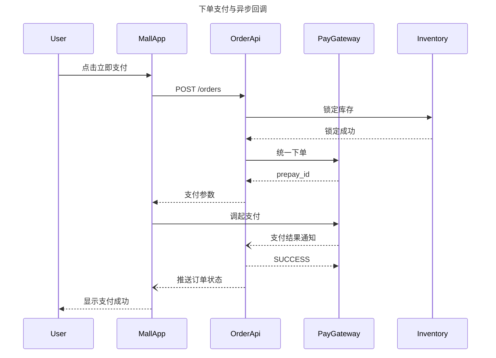

# 时序图

适用：多方（服务、用户、系统）随时间发生的交互——API 请求/响应链路、鉴权握手、多服务编排、RPC 调用追踪、事件级联。

本渲染器只支持 Mermaid 时序图的**一个窄子集**。务必细读第 5 节：注释、循环、alt/else、激活条、彩色块、自动编号等常用特性都会被**静默丢弃**。好在它们大多能在生成后用 `use_figma` 补上（第 7 节）。

## 目录

1. 什么时候用时序图
2. 最小骨架
3. 参与者
4. 消息
5. 不支持的写法
6. 最佳实践
7. 混合工作流
8. 校验清单
9. 完整示例
10. 调用参数

---

## 1. 什么时候用时序图

合适：API 调用链（客户端 → 网关 → 服务 → 存储，含请求与响应）；鉴权握手（OAuth、SAML、OIDC、会话交换）；事件编排（生产者、broker、消费者随时间响应）；消息顺序本身就是重点的多服务流程；协议追踪（WebSocket、gRPC 流、自定义 RPC）。

不合适：没有时间顺序的静态架构 → 架构图；带判断和状态的分支流程 → 流程图；单个实体的状态迁移 → 状态图；数据模型 → ER 图。

## 2. 最小骨架

```
sequenceDiagram
    title 扫码登录
    participant Phone
    participant WebPage
    participant AuthApi
    participant Redis

    WebPage->>AuthApi: GET /qrcode
    AuthApi->>Redis: 写入二维码状态
    AuthApi-->>WebPage: 二维码 + ticket
    Phone->>AuthApi: POST /confirm
    AuthApi-->>WebPage: 登录成功
```

必须有：`sequenceDiagram` 关键字和至少一条消息。`title` 可选但推荐。参与者也可不声明（消息中出现的新 ID 会被自动创建），但显式声明才能控制左右顺序。

**重要**：渲染出来的是 **ID 本身**，别名（`as "显示名"`）会被静默丢弃。

## 3. 参与者

### 别名会被丢弃

解析器忽略 `as` 子句：

```
participant pay as "支付服务"   %% 实际显示 "pay"
participant PayService          %% 显示 "PayService"
```

因此 ID 要本身就好读：用 PascalCase / camelCase（`ClientApp`、`AuthServer`、`Database`），不要用 `a`、`p1` 这类指望别名装饰的短名。**ID 中不能有空格**，会导致解析失败；用户想显示“Auth Server”就写成 `AuthServer`。

### 显式声明

按声明顺序从左到右排列：

```
participant ClientApp
participant AuthServer
participant Database
```

### 参与者类型：渲染效果都一样

Mermaid 有 `participant`、`actor` 两种关键字，以及 `@{"type": "..."}` 形式的 `database`、`queue`、`boundary`、`control`、`entity`、`collections` 等类型。语法上 `@{...}` 必须**紧跟 ID**，不能有逗号或空格；部分文档里的 `participant id, {"type": ...}` 逗号写法在这里**不能用**。

但**本渲染器把所有类型都画成同样的矩形**，类型信息只是被透传、不会有视觉区别。所以**不要写类型注解**，统一用 `participant`。用户明确要区分形状（数据库圆柱、队列横圆柱、小人图标）时，先生成基础时序，再用 `use_figma` 替换形状（第 7 节）。

### 隐式参与者

消息里未声明的 ID 会自动创建。小图可以这么做；稍大的图显式声明以控制顺序。无论哪种，ID 就是显示名。

## 4. 消息

标准形式：`发送方->>接收方: 消息文字`

### 箭头类型

本处理器把 Mermaid 的箭头语法映射为 **8 种视觉效果**：

| 视觉 | 产生它的语法 | 用途 |
|---|---|---|
| 实线 + 三角箭头 | `A->>B`、`A-xB` | **默认**：同步调用、请求 |
| 实线 + 细尖箭头 | `A-)B` | 异步、发出即不管 |
| 实线 + 无箭头 | `A->B` | 少用，通常用 `->>` |
| 点线 + 三角箭头 | `A-->>B`、`A--xB` | **默认返回**：响应、回复 |
| 点线 + 细尖箭头 | `A--)B` | 异步返回、回调 |
| 点线 + 无箭头 | `A-->B` | 少用 |
| 实线 + 双端三角 | `A<<->>B` | 双向同步通道 |
| 点线 + 双端三角 | `A<<-->>B` | 双向异步通道 |

注意：`-x` 与 `->>` 渲染完全相同，`--x` 与 `-->>` 也相同——**叉号样式不支持**。为清晰起见统一写 `->>` / `-->>`。

**基本模式**：请求用 `->>`，响应用 `-->>`，能覆盖约 80% 的时序图。

### 消息文字

写在冒号之后，纯文本，不需要引号。

- 请求：简短祈使式，如 `POST /orders`、`校验签名`、`查询库存`。
- 返回：简短名词短语，如 `200 OK`、`订单号`、`session token`。
- 写上状态码、接口路径、关键标识——这正是时序图的价值所在。

**分号会被改写**：标签中的分号（语句末尾除外）会被预处理改成句号。写 `字段: a, b` 而不是 `a; b`。

## 5. 不支持的写法

以下内容能解析，但**被处理器静默丢弃**，渲染结果里不会出现：

- **注释**：`Note over X`、`Note left of X`、`Note right of X` 全部丢弃（工具说明亦明确时序图不要用 note）。
- **激活条**：`activate X` / `deactivate X`，以及箭头上的 `+`/`-` 简写（`A->>+B: 调用`）。
- **循环**：`loop ... end`——内部消息仍渲染，但外框和标签消失。
- **分支**：`alt ... else ... end`——内部消息平铺，看不出分支。
- **可选**：`opt ... end`——同上。
- **并行**：`par ... and ... end`——并行消息渲染为线性顺序。
- **critical / break**：丢弃。
- **彩色块**：`rect rgb(...) ... end`——无背景高亮。
- **自动编号**：`autonumber`——消息不编号。
- **链接**：`link X: ...`、`links X: ...`。
- **参与者分组框**：`box ... end`。

用户要这些时，**不要硬凑 Mermaid 语法**——输出会悄悄缺失。多数情况下先用本工具生成核心时序（参与者 + 消息），再用 `use_figma` 补齐缺失部分（第 7 节）。

## 6. 最佳实践

1. **主要用两种箭头**：请求 `->>`、返回 `-->>`；只有真正表达异步语义时才加第三种（如 `-)`）。
2. **3 个及以上参与者时显式声明**，控制顺序。
3. **一张图一条流程**：正常路径与异常路径画成两张图，不要用 `alt/else`（反正也渲染不出分支）。
4. **每条消息都写文字**：无标签的箭头几乎没有信息量。
5. **文字简短**：1～5 个词，保留接口路径、状态码、返回类型等关键细节。
6. **消息数控制在约 15 条以内**，超过就按阶段、结果或参与者群拆分。
7. **参与者 ID 可读**：1～2 个词的 PascalCase 最佳（`Api`、`Database`、`AuthServer`），避免 `a`、`p1`，也避免 `AuthenticationServiceV2` 这种过长的名字。

## 7. 混合工作流：先 `generate_diagram`，其余交给 `use_figma`

`generate_diagram` 负责最难的部分：参与者按列排好、消息按顺序带标签、布局一致。渲染器不支持的注释、彩色区域、步骤编号、区分形状的参与者、标注等，恰好是有了基础图后用 `use_figma` 叠加最顺手的内容。

**需要超出“纯消息”的时序图时的默认流程：**

1. **用 `generate_diagram` 搭骨架**：只写参与者 + 消息，跳过会被丢弃的特性。得到一个已排好版的 FigJam 文件。
2. **用 `use_figma` 扩展**（同一个 `fileKey`），补上：
   - 锚定在特定消息旁的便签/文字**注释**；
   - 垫在一组消息后方的矩形，表示**阶段高亮**；
   - 生命线上的竖长矩形，模拟**激活条**；
   - 放在消息旁的**步骤编号**（1、2、3……）；
   - 替换参与者形状：数据库用圆柱、队列用横圆柱、用户用人形图标；
   - 带标签的分组框（如框住若干消息并标注“重试循环”），替代 `loop`/`alt`/`opt`；
   - 同一白板上的说明文字、相邻图表或截图。

写入前先用 `skill_read` 加载 `figma-use` 技能，FigJam 操作再加载 `figma-use-figjam` 技能；写入用户已有文件前用 `ask_user` 确认。定位与样式配方见 [workflow.md](workflow.md)。

### 完全跳过 `generate_diagram` 的情况

只有工具产出的基础图没用时：用户要**非标准布局**（泳道式时间线、放射状时序、手绘风草图）；有**需要高度还原的参考稿**而自动布局会与之冲突；时序**极小**（2～3 条消息），手工摆放比调两个工具更快。这些情况直接用 `use_figma`。

### 需要混合工作流的信号

- 用户说“加注释”“标注”“高亮这个循环”“画出 alt/else 分支”“激活条”“按阶段上色”“给步骤编号”。
- 已生成过时序图，用户要的细化（注释、彩色块、激活条）渲染器做不到。
- 想把时序图和其他内容（架构图、说明、截图）放在同一白板。
- 想要区分形状的参与者。

### 务实，不作秀

不要向用户长篇解释流程。需求具体就直接“搭骨架 + 扩展”依次调用两个工具；需求模糊就先搭骨架，再问一句：“基础时序已生成，需要加注释 / 阶段高亮 / 激活条 / 步骤编号吗？”

## 8. 校验清单（调用前）

1. 第 1 行（忽略前导空白）是 `sequenceDiagram`。
2. 参与者 ID 本身可读，不用 `a`、`p1`——ID 就是显示名。
3. 没有 `as "显示名"` 别名。
4. 参与者上没有 `@{"type": "..."}` 注解，统一用 `participant`。
5. 没有 `Note`、`activate`/`deactivate`、`+`/`-` 激活简写、`loop`、`alt`、`opt`、`par`、`critical`、`break`、`rect`、`autonumber`、`link` 行。
6. 每条消息都有文字。
7. 文字中没有分号。
8. 消息数约 15 条以内，否则已拆分。
9. 箭头类型是有意选择的：请求 `->>`，返回 `-->>`，其他仅在有语义时使用。

## 9. 完整示例

微信风格的第三方支付回调流程：



## 10. 调用参数

- `name`：描述性的图名
- `mermaidSyntax`：时序图源码
- `userIntent`：用户目标
- **不要**传 `useArchitectureLayoutCode`（仅架构图使用）
