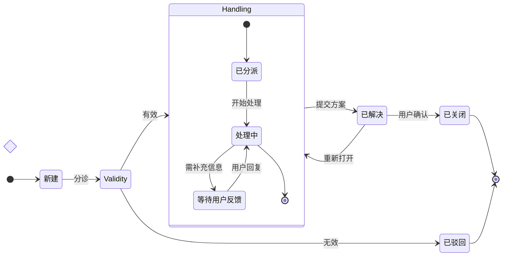

# 状态图

适用：**单个实体或系统**的若干状态以及状态之间的迁移——订单从待支付 → 已支付 → 已发货 → 已签收，账号的正常 / 冻结 / 注销，TCP 连接，部署流水线等任意状态机。

主题是**多方随时间的交互** → 时序图（[sequence.md](sequence.md)）；只是**有分支的决策树而没有“状态”概念** → 流程图（[flowchart.md](flowchart.md)）。

## 目录

1. 什么时候用状态图
2. 最小骨架
3. 状态的三种声明方式
4. 起点与终点 `[*]`
5. 迁移
6. 复合（嵌套）状态
7. 特殊状态：choice、fork、join
8. 不支持的写法（会产生幽灵状态）
9. 布局
10. 混合工作流
11. 最佳实践
12. 校验清单
13. 完整示例
14. 调用参数

---

## 1. 什么时候用状态图

合适：实体生命周期（订单、账号、订阅、工单、文档）；协议/流程状态机；功能开关与灰度状态（实验中 / 开启 / 关闭 / 归档）；审核流（草稿 / 已提交 / 已通过 / 已发布）；会话生命周期（空闲 / 活跃 / 过期 / 吊销）。

不合适：多方交互 → 时序图；无状态实体的决策树/流水线 → 流程图；服务与存储 → 架构图；带日期的时间线 → 甘特图；数据模型 → ER 图。

## 2. 最小骨架

```
stateDiagram-v2
    direction LR
    [*] --> Unpaid
    Unpaid --> Paid: 支付成功
    Unpaid --> Closed: 超时
    Paid --> Shipped: 发货
    Shipped --> Received: 签收
    Received --> [*]
    Closed --> [*]
```

必须有：第 1 行 `stateDiagram-v2` 关键字和至少一条迁移。`direction` 可选：通常用 `LR`，层级深时用 `TB`。统一用 `stateDiagram-v2`，不用旧版 `stateDiagram`。

## 3. 状态的三种声明方式

### 纯 ID

`Paid --> Shipped`：ID 同时是引用名和显示文字，适合短而好读的名字。

### ID + 描述（冒号写法）

```
Unpaid: 待支付
Unpaid --> Paid
```

迁移中引用 `Unpaid`，渲染显示“待支付”。显示文字含空格、标点或细节、又不想在每条迁移里重复时使用。

### `state "描述" as ID`

```
state "等待人工复核" as ManualCheck
ManualCheck --> Paid
```

与冒号写法等价，同一张图选一种风格坚持用。

### 显示名规范化

预处理会去掉引号并在内部规范化状态 ID。**渲染的永远是描述**：纯 ID 状态的描述就是 ID；冒号或 `as` 写法则显示你给的描述。不必折腾特殊引号，直接写普通描述即可。

### 名字中有空格

纯 ID 不能有空格（`Under Review` 会出错），用冒号或 `as` 写法：`Reviewing: 审核 中`。**中文显示名同样建议走冒号/as 写法，ID 保持英文 camelCase/PascalCase。**

## 4. 起点与终点 `[*]`

`[*]` 既是起点也是终点，由箭头方向区分：`[*] --> Unpaid` 是起点迁移，`Received --> [*]` 是终点迁移。允许多个入口和出口。

在复合状态内部，`[*]` 表示该复合状态自己的入口/出口（见第 6 节）。

## 5. 迁移

```
From --> To
From --> To: 标签
```

- 用 `-->`（双横线），不是 `->`。
- 冒号后写标签，通常是触发迁移的事件或动作（提交、审批、超时、重试）。
- 标签 1～3 个词；目标状态名已说明一切时可以不写。

**自迁移**可用：`Online --> Online: 心跳`。

**环是合法的**：工单可以重开，账号可以冻结后恢复。ELK 对中小规模的环处理得不错，真实存在就画出来。

## 6. 复合（嵌套）状态

用 `state 父状态 { ... }` 把相关子状态包起来：

```
stateDiagram-v2
    [*] --> Serving
    Serving --> [*]

    state Serving {
        [*] --> Waiting
        Waiting --> Handling: 新请求
        Handling --> Waiting: 处理完成
        Handling --> [*]
    }
```

复合状态渲染成包含子节点的**子图框**；内部的 `[*]` 只作用于该复合状态的入口/出口，而不是整张图。

### 嵌套

支持多层嵌套，但**最多 2 层**，更深会让 ELK 布局拥挤。

### 并发区域：`--` 分隔符

在复合状态中用 `--` 切分并发区域，每个区域渲染为父复合状态中的一个嵌套子图：

```
state Syncing {
    state "上传本地变更" as Upload
    [*] --> Upload
    Upload --> [*]
    --
    state "拉取远端变更" as Download
    [*] --> Download
    Download --> [*]
}
```

每个区域有自己的 `[*]` 入口和出口。当一个外层状态内有两条互相独立、同时运行的子流程时使用。

### 跨复合状态的迁移：保持简单

Mermaid 禁止在**不同**复合状态的内部子状态之间直接迁移。改为与外层复合状态之间迁移：

```
%% 可以：外层之间
Serving --> Maintenance
Maintenance --> Serving

%% 不行：伸进另一个复合状态的内部
Serving.Handling --> Maintenance.Patching
```

## 7. 特殊状态：choice、fork、join

### choice：条件分支

```
state RiskCheck <<choice>>
Submitted --> RiskCheck
RiskCheck --> AutoPass: 低风险
RiskCheck --> ManualCheck: 高风险
```

渲染为菱形，用于在单一点按条件分支。

### fork / join：并行路径

```
state SplitWork <<fork>>
state MergeWork <<join>>

[*] --> SplitWork
SplitWork --> Packing
SplitWork --> Invoicing
Packing --> MergeWork
Invoicing --> MergeWork
MergeWork --> [*]
```

fork 分成并行路径，join 合并回来，渲染为独立的条形。慎用——不熟悉 UML 状态机符号的读者容易困惑。

## 8. 不支持的写法（会产生幽灵状态）

- **注释**：`note left of X`、`note right of X`、`note above/below`。**严格避免。** 它们与预处理器冲突：note 里的 `X: 文本` 会被当成状态定义，产生**重复的幽灵状态**，结果不是“少了注释”，而是**图画错了**。需要注释就先不带注释生成，再用 `use_figma` 加真正的便签或文字（第 10 节）。
- **样式**：`classDef`、`class Foo 样式名`、行内 `:::样式名`、`style X fill:#...,stroke:#...`。**严格避免。** 不仅不生效，这些语句里引用的状态名还会被注册成独立状态，在真实图的上方或旁边出现**孤立的幽灵方框**。与 note 一样是“画错”而非“缺失”。需要配色在生成后用 `use_figma` 处理（第 10 节）。
- **伸进其他复合状态内部的迁移**：Mermaid 本身就禁止，改为与外层复合状态迁移。

## 9. 布局（与流程图相同的 ELK）

状态图与流程图使用**同一套 ELK 分层布局**，[flowchart.md](flowchart.md) 第 5 节“ELK 布局应对”直接适用：

- **简单的环渲染良好**：重试、重开、恢复路径，不要为了避环扭曲状态机。
- **子图聚类干净**：复合状态自动使用这一能力。
- **扩散入边超过约 5 条会变乱**：很多状态汇向同一个“失败”或“终止”状态时考虑拆图或复制——但注意状态语义通常不允许随意复制状态。
- **规模越大越痛**：一张图 20 个以上状态开始拥挤，按阶段/子系统拆分或引入更多复合分组。

状态图特有的两点：

- **让复合状态凸显**：和流程图子图一样，复合状态默认只有细边框，容易与画布混在一起。流程图中给子图加浅色底的建议同样适用（用 FigJam 调色板浅色），但预处理器**不会提取** `classDef`/`class`/`style`，所以必须通过混合工作流（第 10 节）上色。
- **自迁移间距较紧**：`Online --> Online: 心跳` 能渲染，但回环弧线和标签可能贴着状态。不要因此回避自迁移（它们是真实行为），但可以告诉用户：间距太紧时可在 Figma 中手动拖动回环或标签。

## 10. 混合工作流：先 `generate_diagram`，再 `use_figma`

`generate_diagram` 能产出排好版的状态机，这是最难的部分；渲染器不支持的注释、状态着色、步骤标注、阶段高亮都可以在之后用 `use_figma` 叠加。

**需求超出“状态 + 迁移”时的默认流程：**

1. **用 `generate_diagram` 搭骨架**：状态、迁移、复合状态、并发区域（`--`）、choice/fork/join、起点/终点。跳过会造成幽灵状态的 note 与样式语句。
2. **用 `use_figma` 扩展**（同一个 `fileKey`）：
   - 锚定在特定状态或迁移旁的便签/文字**注释**；
   - 垫在一组状态后方的背景矩形，表示**阶段高亮**；
   - 给复合状态/子图加浅色填充，使边界清晰；
   - 按类别**着色**（终态 / 活跃 / 错误）；
   - 给迁移加**序号**，用于逐步讲解。

写入前先用 `skill_read` 加载 `figma-use` 技能，FigJam 操作再加载 `figma-use-figjam` 技能；写入用户已有文件前用 `ask_user` 确认。配方见 [workflow.md](workflow.md)。

### 需要混合工作流的信号

- 用户说“加注释”“标注”“高亮”“把错误状态标红”“把正常路径打底色”“给迁移编号”。
- 想把状态图与说明文字或其他图放在同一白板。

### 完全跳过 `generate_diagram` 的情况

只有基础布局没用时，例如用户要环形状态轮盘、手绘草图、强风格化的企业模板。这时直接用 `use_figma`。

### 务实，不作秀

需求具体就搭完骨架直接扩展；否则搭完骨架后只追问一句：“基础状态机已生成，需要加注释 / 给状态着色 / 高亮错误路径吗？”

## 11. 最佳实践

1. 用 `stateDiagram-v2`，不用旧版 `stateDiagram`。
2. **状态名是名词**（草稿、生效中、已归档），动作放在迁移标签里。
3. **迁移标签是事件/触发器**（提交、审批、超时），1～3 个词。
4. **每张图以 `[*] -->` 开始**，显式入口更清楚。
5. **真正终结的状态用 `--> [*]` 收尾**；不是每个状态机都需要终点，有些是永续的。
6. **3 个及以上子状态共享生命周期时用复合状态**（如 `Serving { Waiting, Handling }` 与 `Maintenance` 对比），两个状态不值得组合。
7. **状态数控制在约 15～20 个**，超出就按阶段或实体拆分，或把细节收进复合状态。
8. **一张图一个状态机**：概览图和某个复合状态的放大图分成两张，不要在一张里深度嵌套。

## 12. 校验清单（调用前）

1. 第 1 行是 `stateDiagram-v2`（不是 `stateDiagram`）。
2. 所有迁移都用 `-->`。
3. 每个 `[*]` 都位于某条迁移的一端，不单独出现。
4. 状态 ID 是不含空格的简单单词；较长文字用 `:` 或 `as` 提供描述。
5. 没有 `note left of`、`note right of` 等——会产生幽灵状态。
6. 没有 `classDef`、`class`、`:::`、`style` 行——不上色且产生孤立幽灵状态。
7. 没有伸进其他复合状态内部的迁移。
8. 复合嵌套 ≤ 2 层。
9. 状态数约 20 个以内，否则已拆分。

## 13. 完整示例

一个工单处理状态机，含复合状态、choice、环与多个终点：



> 注：choice 状态通常不渲染描述文字；若 `state "..." as X <<choice>>` 组合写法在实际渲染中出错，改成 `state Validity <<choice>>` 即可。

## 14. 调用参数

- `name`：描述性的图名
- `mermaidSyntax`：状态图源码
- `userIntent`（可选）：用户目标
- **不要**传 `useArchitectureLayoutCode`（仅架构图使用）
