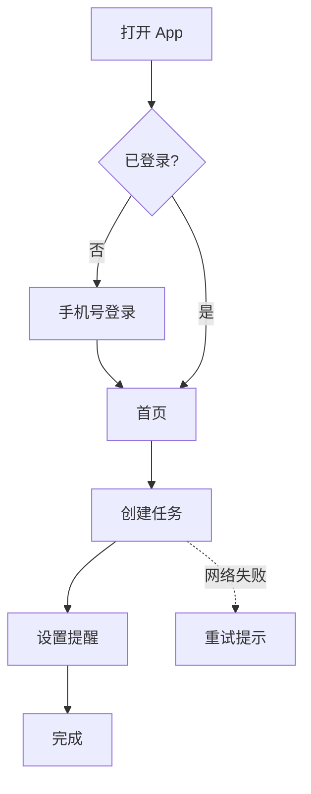

# 产品简报模板（design/brief.md）

按需删减，不要为了填满而编造。无法核实的内容标注“假设，待验证”。

```markdown
# <产品名> 设计简报

## 一句话定位
<为谁>、在<什么场景>下、用<什么方式>、解决<什么问题>。

## 目标用户与关键场景
| 画像 | 特征 | 关键场景 | 当前替代方案 |
| --- | --- | --- | --- |

## 要完成的任务（JTBD）
- 当<情境>时，我想要<动机>，以便<期望结果>。

## 功能范围
- MVP 必做：
- 之后再做：
- 明确不做：

## 成功指标
| 指标 | 定义 | 目标值（假设） |
| --- | --- | --- |

## 设计原则（3 条以内）
- 例如：一屏只有一个主要行动；新手 30 秒内完成首个任务。

## 风险与待验证假设
| 假设 | 验证方式 | 优先级 |
| --- | --- | --- |

## 参考与来源
- <竞品/资料名>：<链接>
```

# 用户流程（design/flows.md）

~~~markdown
## 主流程：<名称>
入口：<从哪里进入>



## 页面清单
| 页面 | 目的 | 关键元素 | 跳转到 |
| --- | --- | --- | --- |
~~~

注意：每条主流程至少标出一个异常分支（网络失败 / 权限被拒 / 空数据 / 校验失败）。
