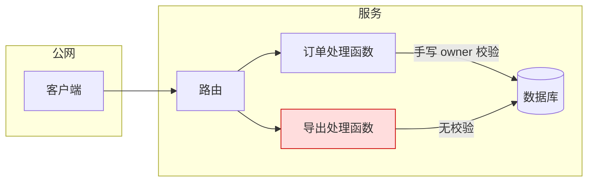
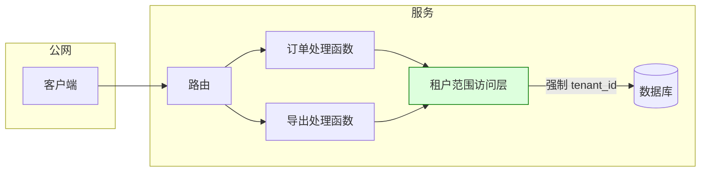

# 加固提案与组合（portfolio）格式

`security-hardening` 的产出分两层：

- **组合文档**（`portfolio.md`）：盘点所有加固机会、给出排序与取舍，供决策者一次看全。
- **单个提案**（`proposals/H-xx-<短名>.md`）：只为被选中（或用户点名）的机会撰写，足以让工程团队据此排期与实施。

默认目录：`<仓库根>/security-scans/hardening-<YYYYMMDD>/`（与扫描产物同级，提醒用户加入 `.gitignore`）；用户指定时以用户为准。不修改任何源代码。

```
security-scans/hardening-<YYYYMMDD>/
├── portfolio.md
├── evidence.md            # 证据总表（可选，证据多时拆出）
└── proposals/
    ├── H-01-tenant-scoped-data-access.md
    └── H-02-outbound-request-gateway.md
```

## 1. 写作要求

- **先结论后论证**：每份文档第一屏就能看到"建议做什么、为什么现在做、代价多大"。
- **每个断言可追溯**：事实类句子后附证据编号 `[E-03]`；推断写"推断："；假设编号 `A-xx` 并进入开放问题。
- **用系统的语言**：描述控制在哪一层、谁负责、什么情况下失效，而不是罗列漏洞。
- **中立对待方案**：每个方案写明它最擅长什么、最怕什么。
- **不夸大**：没有证据的风险不写成"严重"；findings 的严重度沿用来源记录。
- 篇幅参考：组合 1–3 页；单个提案 3–8 页，图与表优先于大段文字。

## 2. 证据体系

### 2.1 证据编号表

| 编号 | 类型 | 来源 | 内容摘要 | 支撑的结论 |
| --- | --- | --- | --- | --- |
| E-01 | finding | `security-scans/20250301-101500-standard/findings.json#F-003` | 订单导出接口缺少租户校验 | 同类问题反复出现 |
| E-02 | 代码 | `src/api/orders.py:88-104` | 查询只按 `order_id` 过滤 | 授权逻辑分散在处理函数 |
| E-03 | 威胁模型 | `docs/threat-model.md#多租户` | 租户隔离是一级资产边界 | 期望不变量 |
| E-04 | 统计 | `file_grep` 结果，见附录命令 | 142 处 ORM 查询中 37 处无 `tenant_id` 条件 | 覆盖面估计 |

类型取值：`finding`（来自 findings.json 或 findings-status.json）、`代码`、`配置`、`威胁模型`、`测试`、`运行证据`、`统计`、`文档`、`访谈/用户说明`。

规则：

- 编号在整个组合中唯一；提案引用组合中的同一编号，不重新编号。
- 统计类证据写出可复现的命令或搜索式。
- 已修复（`findings-status.json` 中 `fixed`）的 finding 仍可作为"模式"证据，但要注明已修复。
- `rejected` 的 finding 不能作为薄弱点证据；`plausible` 的 finding 只能作为弱证据，并在文中标注。

### 2.2 系统性薄弱点的判定

满足任一即可立为"机会"：

1. **重复模式**：≥2 个 finding（或 1 个 finding + 代码统计中的多个同类实例）根因相同。
2. **缺失的集中控制**：同一安全职责（鉴权、出站请求、输出编码、密钥获取、文件路径处理、反序列化）由各调用点各自实现，且实现不一致。
3. **威胁模型与实现不符**：威胁模型声明的边界在代码中没有对应的执行点。
4. **不安全默认值**：框架或内部库的默认行为是放行，需要调用方主动加固。
5. **不可验证**：关键不变量没有任何测试或静态检查能证明其成立。

单个孤立 bug 不是加固机会，应转 `security-fix-finding`。

## 3. 组合文档格式（portfolio.md）

```markdown
# 安全加固组合：<目标系统/仓库>

## 结论速览
3–5 条要点：最值得做的 1–2 项、预期消除的问题类别、总体代价量级、需要谁决策。

## 证据基础
- 输入：扫描目录、威胁模型、用户提供的材料、时间范围
- 覆盖与局限：哪些模块未分析、哪些 findings 未验证
- 证据编号表（或链接 evidence.md）

## 约束
用户/组织给出的硬约束（上线窗口、不可引入新服务、语言栈、合规）与本次分析的非目标。

## 机会清单
| 编号 | 机会 | 薄弱点类型 | 关联证据 | 消除的问题类别 | 代价量级 | 现状风险 | 建议 |
| --- | --- | --- | --- | --- | --- | --- | --- |
| H-01 | 租户范围的数据访问层 | 缺失的集中控制 | E-01,E-02,E-04 | 跨租户越权 | 中 | 高 | 立即立项 |
| H-02 | 统一出站请求网关 | 重复模式 | E-06,E-07 | SSRF | 中 | 中 | 下个周期 |
| H-03 | 模板默认自动转义 | 不安全默认值 | E-09 | 存储型 XSS | 小 | 中 | 顺手完成 |

建议取值：`立即立项` / `下个周期` / `顺手完成`（低代价，可并入日常迭代）/ `观察`（证据不足，先补证据）/ `不做`（写明理由）。

## 排序理由
为何这样排序：现状风险、问题类别广度、代价、依赖关系（H-03 是 H-01 的前提等）。

## 待决策事项
需要用户或负责人拍板的问题，每项给出默认建议。
```

## 4. 单个提案格式（proposals/H-xx-*.md）

各小节顺序固定；不适用的小节保留标题并写"不适用：原因"。

### 4.1 决策

一句话写明请求的决定，例如："批准在 Q3 引入租户范围的数据访问层（方案 B），并在迁移完成后禁用原始查询 API。" 附决策人（未知写"待确认"）与期望决策时间。

### 4.2 执行建议

面向决策者的 5–8 行摘要：问题、推荐方案、收益（消除哪类问题、关闭哪些 findings）、代价（工作量量级、兼容影响）、不做的后果。

### 4.3 证据

引用组合中的证据编号表子集，按"它证明了什么"分组：问题存在、问题反复、现有控制失效、约束来源。

### 4.4 现有设计与失效模式

- 当前这项安全职责由谁、在哪一层、以何种方式履行。
- 失效模式：列举具体的失效路径（"新增路由时忘记调用 `check_owner`"、"后台任务绕过中间件"），每条附证据。
- 为什么逐个修补无法根治。

### 4.5 期望不变量

用可检验的陈述写 2–5 条，每条注明如何验证：

| 编号 | 不变量 | 验证方式 |
| --- | --- | --- |
| I-1 | 任何读取租户数据的查询都带有当前主体的 `tenant_id` 条件 | 静态检查 + 全路由枚举测试 |
| I-2 | 未显式声明为公开的路由默认要求认证 | 启动时路由表断言 |

### 4.6 约束与非目标

硬约束（技术、组织、时间、合规）与明确不解决的问题，防止范围蔓延。

### 4.7 前后架构

两张 Mermaid 图，使用**相同的节点命名和布局方向**，便于对照；控制点用统一样式标出，信任边界用子图表示。





图规则：节点 ≤ 15 个；只画与本机会相关的组件；图下用 2–3 句说明变化点；Mermaid 语法需可渲染（节点 ID 用 ASCII，标签可用中文）。

### 4.8 多方案对比

2–4 个实质不同的方案，每个方案小节写：做法、改动范围、满足哪些不变量、主要风险、前提条件。之后给出权衡维度表，维度与档位按 `tradeoff-dimensions.md`。

### 4.9 推荐

选定方案与理由；正面回应其 `−−` 维度；说明在什么条件下应改选其他方案（决策翻转条件）。

### 4.10 残余风险

推荐方案落地后仍存在的风险：未覆盖的入口、依赖的假设、未关闭的 findings。每项给出负责人建议或后续机会编号。

### 4.11 迁移与发布

分阶段：准备（引入新机制、影子模式/仅记录）→ 迁移（按模块切换，附进度度量）→ 强制（默认拒绝、移除旧 API）→ 清理。每阶段写回退方式与进入下一阶段的判据。

### 4.12 验证计划

- 证明每条不变量成立的测试或静态检查。
- 回归：原 findings 的复现用例全部失败（即被阻止）。
- 上线观测：指标、告警、日志字段。
- 可选：用 `security-diff-scan` 审查实施 PR，用 `security-patch-risk` 评估合并风险。

### 4.13 实施工作包

| 编号 | 工作包 | 范围（文件/模块） | 依赖 | 规模 | 完成判据 |
| --- | --- | --- | --- | --- | --- |
| WP-1 | 新增 `ScopedRepository` 与单元测试 | `src/data/` | — | S | I-1 单元测试通过 |
| WP-2 | 迁移订单与导出模块 | `src/api/orders.py` 等 | WP-1 | M | E-04 中该模块查询清零 |

工作包应能独立评审与合并；规模用 S/M/L，不写人日，除非用户提供了估算基准。

### 4.14 开放问题

列出假设（A-xx）与待确认事项，每项写：问题、为何重要、谁能回答、默认处理方式。

## 5. 自检清单

- [ ] 每个机会至少有 2 条证据，且至少 1 条来自代码或 finding。
- [ ] 所有事实句可追溯到证据编号；假设都已编号并进入开放问题。
- [ ] 不变量可检验，验证计划逐条覆盖。
- [ ] 前后两张图节点命名一致，可渲染。
- [ ] 方案实质不同，包含最小改动基线。
- [ ] 推荐回应了自身的致命缺点并写明翻转条件。
- [ ] 残余风险与未关闭的 findings 已列出。
- [ ] 未修改任何源代码；产出只写在约定目录。
