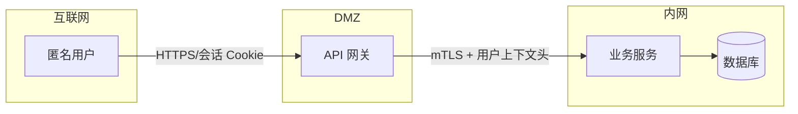

# 威胁模型文档模板

本模板定义 `security-threat-model` 产出的 Markdown 结构。独立模式使用第 0–5 节与页脚；扫描模式额外附第 6、7 节。没有内容的小节写"无"并说明原因，不要堆砌空模板。不要在文档中复述方法论本身。

---

## 0. 元信息

| 项 | 内容 |
| --- | --- |
| 范围 | 全仓 / `services/api/` 等；列出明确排除的目录及原因 |
| 模式 | 独立 / 扫描（`scan_id`） |
| 输入 | 源码、`SECURITY.md`、设计文档、用户口述（逐项标注来源） |
| 架构复核 | 独立子代理复核 / 顺序复核（非独立） |
| 适用策略 | 生效的 `SECURITY.md` 路径链（根 → 组件） |

## 1. 系统概览

1. 一段话说明：产品做什么、谁在用、以什么形态部署（SaaS、自托管、桌面、CLI、库、CI 工作流）。
2. **组件表**

| 组件 | 职责 | 运行位置 / 身份 | 主要入口 | 证据 |
| --- | --- | --- | --- | --- |
| API 网关 | 认证、路由 | 容器，服务账号 `api` | `POST /v1/*` | `src/gateway/app.py:12` |

3. **有效资源表**（仅当配置会改变安全边界时填写；不同启动路径给同一资源不同取值时分行）

| 部署/流程 | 资源或能力 | 配置来源与优先级 | 安全的有效值/位置 | 读者/写者/接收方 | 执行控制的组件 | 证据或未知 |
| --- | --- | --- | --- | --- | --- | --- |
| docker-compose | 上传目录 | `UPLOAD_DIR` 环境变量 > `config.yaml` > 默认 `/data/up` | 宿主机 `./data/up` 挂载 | api 可写、nginx 可读 | nginx `location` 禁止执行 | `compose.yml:30`、`src/cfg.py:44` |

密钥类配置只写"键名/引用、存储位置、谁能读"，不写值。

4. **数据流图**（可选，确实能让信任区更清楚时才画）



跨信任边界的连线要在图上标明传递的数据或权限。

## 2. 资产、参与者与信任边界

### 2.1 资产与安全目标

| 资产 | 敏感级别 | 需要保持的性质（机密/完整/可用/可追溯） | 安全不变量 |
| --- | --- | --- | --- |
| 用户个人资料 | 高 | 机密、完整 | 只有本人与本租户管理员可读写 |

### 2.2 参与者与攻击者能力

| 参与者 | 初始能力（能控制什么） | 不具备的权限 | 边界失效后可能获得的新能力 |
| --- | --- | --- | --- |
| 匿名互联网用户 | 任意 HTTP 请求内容 | 任何会话 | 读取他人数据、执行代码 |
| 已登录普通用户 | 自己的会话与数据 | 他人数据、管理功能 | 越权、提权 |
| 恶意依赖/上游数据 | 被解析的文件或响应 | — | 解析器漏洞导致代码执行 |

### 2.3 信任边界

| 编号 | 边界（从 → 到） | 传递的数据/权限 | 应有控制 | 实际执行控制的位置 | 证据 |
| --- | --- | --- | --- | --- | --- |
| TB-1 | 互联网 → 网关 | 请求体、Cookie | 认证、限流、大小限制 | `src/gateway/auth.py:40` | … |

### 2.4 假设、排除与未知

- **代码确认的事实**：…
- **用户/文档提供的部署上下文**（标注来源）：…
- **条件性假设**（"若部署在公网则…"）：…
- **排除项**：…（引用策略或用户决定）
- **文档与配置不一致**：文档声称 X，代码实际为 Y（`path:line`）
- **未解决问题**：…

## 3. 攻击面、缓解与攻击者故事

按优先级排序；所有条目默认为**假设**，已独立验证的在"证据"列注明。

| 编号 | 优先级 | 场景与能力增益 | STRIDE | 前提条件 | 影响 | 现有控制 | 建议缓解 | 证据 |
| --- | --- | --- | --- | --- | --- | --- | --- | --- |
| TS-01 | 高 | 普通用户通过修改 `order_id` 读取他人订单（获得跨账户读） | I / E | 已登录 | 高 | 无归属校验（推断） | 查询加 `owner_id` 条件 | `src/orders.py:88` |

对每条重要边界：要么有场景，要么写明"无新增能力"的理由（例如攻击者本就拥有该权限）。

## 4. 严重度校准

分 Critical / High / Medium / Low 四级，每级给出本系统的**具体例子与反例**：

- **Critical**：例：未认证远程代码执行；反例：需要管理员凭据才能触发的命令执行（通常降为 Medium/Low）。
- **High**：…
- **Medium**：…
- **Low**：…

说明哪些前提或有效控制会升降级、哪些故事超出实际安全边界。置信度与缺失证据单独说明，不与影响混为一谈。与 `../../security-attack-path/scripts/severity_calc.py` 的 impact × likelihood 矩阵保持一致。

## 5. 变更记录

| 日期 | 版本 | 变更 | 作者 |
| --- | --- | --- | --- |
| 2025-01-01 | abc1234 | 初版 | miniQ |

---

## 6. 调查任务包（仅扫描模式）

每个任务包对应一组可由一个发现子代理独立完成的工作，供 `security-finding-discovery` 用 `agent_run` 并行分派：

```markdown
### PKT-01 订单 API 对象级授权
- 攻击面：HTTP API / 订单
- 关联场景：TS-01、TS-04
- 风险类别：IDOR、越权、批量赋值
- 入口：`src/routes/orders.py`（全部路由）
- 需检查的控制：`src/auth/owner.py`、ORM 查询过滤
- 文件范围：src/routes/orders.py, src/services/order_*.py, src/models/order.py
- 待回答问题：列表接口是否按租户过滤？管理员接口是否复用普通用户中间件？
- 已知反证/已有控制：全局中间件 `require_login`（`src/app.py:22`）
- 预期产出：candidates（C-xxx）或该攻击面的 no_issue 说明
```

规则：任务包之间文件范围尽量不重叠；每个中/高优先级场景至少进入一个任务包；不把威胁假设写成结论。

## 7. 攻击面清单（仅扫描模式）

与 `coverage.json` 的 `surfaces[]` 一一对应，名称保持一致：

| 攻击面 | 风险类别 | 任务包 | 初始状态 |
| --- | --- | --- | --- |
| HTTP API | 注入、越权 | PKT-01, PKT-02 | 待调查 |
| 文件上传 | 路径穿越、存储型 XSS | PKT-03 | 待调查 |

---

## 页脚（持久化复用用）

```
仓库：<远端 URL 或仓库根目录名>
版本：<git 提交号；未提交改动写 working-tree-<日期>>
生成时间：<ISO 8601>
```

只有页脚的仓库与版本都和当前一致时才可直接复用；扫描上下文特有的信息（用户临时提供的部署细节）不要写回共享模型，除非用户要求。
