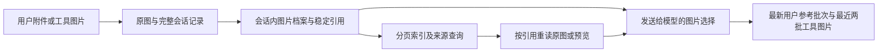

# 图片历史管理：本机客户端实测与 miniQ 实现

2026-09-20。本次改动针对模型请求中的视觉历史，不改变聊天界面的图片、交付文件、远程预览或原图。

## 对照本机 ChatGPT/Codex 的实际行为

使用 `/Applications/ChatGPT.app/Contents/Resources/codex`（0.153.4）执行人工图片测试，provider 指向仅监听本机的 Responses mock。记录实际 HTTP 请求、工具声明和两次 `view_image` 调用。没有使用真实 API Key、上传私密图片或请求付费模型。该路径是本机应用使用的运行时，但不能据此推断全部桌面浏览器、截图或 WebSocket 路径。

| 实测项目 | 本机运行时结果 | miniQ 本次选择 |
| --- | --- | --- |
| 默认大图查看 | 3200×2400 图片缩到 1824×1368 | `view_image` 默认限制在 2048×2048、250 万像素内，等比例缩放 |
| 精细查看 | `detail: original` 保留完整原始分辨率 | 显式原图模式，并通过历史引用随时重读原图 |
| 连续读取同一图片 | 三次请求含图数量为 1、2、3，重复图哈希一致 | 同一图片路径/MIME 的活跃引用在单个请求内去重 |
| 旧图重传 | 请求体约 11.90、23.75、35.60 MB，仍重复携带 base64 | 发送最近必要的图片，较早图片保留稳定引用，按需回读 |
| 原图测试 | 第三次调用改用 original，仍携带此前两张缩图 | 回读可显式组成比较批次，之后遵循同一历史管理规则 |

测试图片是高熵随机 PNG，不能把其压缩比例当成一般截图的平均值。实验验证了“默认预览 + 显式原图”的实现，**没有证明 ChatGPT 自动归档或去除历史重复图片**。miniQ 的请求投影与持久归档是本次新增设计。

另用 480×320 人工图片核查实际请求中的四条 developer 指令。与本任务相关的是通用的上下文压缩、保留目标/约束/已完成工作/待办、避免重做的要求；未发现明确的旧图去重、退休、OCR 替代视觉或目录回读策略。图片分辨率语义来自实际 `view_image` 工具合同。完整桌面专属指令、服务器调度及 WebSocket 路径不在此次实验覆盖范围内。

## 实现方案



1. **原图与请求分离。** `ChatMessage.images` 和原始图片文件保持完整；`image_archive` 是本地 checkpoint 元数据，不直接发送给模型。每次请求生成独立副本，省去较旧图片的像素，并明确标记 `included: false` 和可读取的图片 ID。
2. **按批次保留视觉信息。** 保留最近一次包含图片的用户消息，以及最近两个有图片的工具批次。同一个 assistant 步骤中的并行结果、多页 PDF 和多图比较作为完整批次处理，不按任意张数截断。已归档图片可一次批量重读。
3. **保留参考图片的顺序。** 最新用户附件的序号保存在档案中，即使文字历史被压缩，仍能恢复该批参考图片。恢复说明明确这是历史证据，不是新用户命令。
4. **可用的回读入口。** Agent 提供 `image_history`：`list` 分页返回轻量索引，`sources` 分页查询某张图的完整来源，`read` 根据 ID 返回真实像素。只接受当前会话/agent 已见图片的引用，不接受任意路径或跨会话 ID 查询。
5. **压缩不丢来源。** 在工具结果裁剪或模型摘要前建立结构化档案。归档载体在摘要后确定性恢复，路径、调用 ID、页码和工具参数不依赖摘要模型是否记住。摘要模型只看到文字和元数据，提示词明确禁止凭元数据编造视觉细节。
6. **正常查看与原图查看。** `view_image` 默认使用有界预览；小图不放大。`original` 和 `image_history read` 默认读取原分辨率。输出同时说明原始尺寸与实际发送目标尺寸。不会使用 OCR 代替模型视觉。
7. **电脑控制保持坐标。** 电脑、浏览器截图以及原有 `High/Auto` 输入不缩放。回读结果标记为历史证据，不生成新截图 ID，不绕过观察时效、归属或动作校验。原生 computer call/output 的配对仍由已有适配器处理。
8. **协议和恢复统一。** 父任务、子 agent、重试、跨轮恢复共用请求选择逻辑，但各 agent 只查询自己已观察的图片，不自动继承父任务档案；委派时应提供明确的文件/附件上下文。Responses、Chat Completions（包括当前 Gemini 兼容路径）和 Anthropic 保留各自原生 reasoning、签名与工具调用上下文。
9. **工具调用仍可审计。** 回读和失败回读进入现有工具开始/结束事件、会话/子 agent 归属及审计。持久化时沿用敏感字段脱敏；不存在全局可查询的图片目录。
10. **安全读取与资源边界。** 回读前检查文件，编码时再次安全打开；拒绝符号链接、非普通文件和超限输入。读取上限 20 MiB，解码分配上限 128 MiB；动画必须显式抽帧，避免悄悄丢帧。

## Harness 提示与工具使用

请求级视觉策略由 `image_history_tool.rs` 注入，不在每次重试时重复写入持久历史。它要求模型：

- 用图片引用记录已确认的视觉发现；对未在当前请求中展示的旧图，不凭摘要猜测。
- 新的视觉判断、精细核查、多图比较需要真实像素时，批量回读所需图片。
- 独立查看可并行；存在依赖或需要一起比较的图片保持同批。
- 默认预览用于普通查看，原图用于小字、细节和像素级核验。
- 旧截图仅作历史证据，操作电脑/浏览器前获取新观察。

内部工具示例：

```json
{"action":"list","offset":0,"limit":20}
{"action":"sources","id":"img_1","offset":0,"limit":20}
{"action":"read","ids":["img_1","img_4"],"detail":"original"}
```

参数定义由 serde/schemars 生成，运行时检查批次和分页范围。Responses 显式声明根对象；Claude 与 Chat 兼容适配合并 schema 的操作枚举，避免只暴露 `list` 而漏掉 `read`。

## 验证边界

使用此前“白泽”失败会话重建的持久历史、工具定义和相同图片文件，走当前实际 Responses adapter，发向本机 HTTP 接收器测量。仅改变图片历史投影及其工具/策略声明，不改变图片文件，不发往真实模型：

| 指标 | 优化前 | 优化后 |
| --- | ---: | ---: |
| HTTP JSON 请求体 | 13,288,627 B | 7,968,879 B |
| 携带像素的图片数 | 8 | 4 |
| 请求体减少 | — | 40.03% |

保留的四张图片来自最近两个完整工具批次。测量使用历史记录已有的分辨率策略，节省主要来自历史选择，没有把缩图收益算进去。这是一次固定输入的传输量验证，不等同于真实模型完成任务的质量评测，也不是所有任务都保证节省 40%。

本地自动化覆盖原图保留、完整批次、重复引用、分页与越界、跨会话拒绝、上下文压缩、父/子任务重启恢复、失败回读、敏感字段脱敏、真实 provider 序列化及电脑控制观察绑定。

本次验证通过：agent 70 项、models 95 项、visual 7 项、daemon 图片相关 8 项，另单独执行上述私有记录离线计量。`cargo check --workspace`、桌面 Tauri `cargo check`、`cargo fmt --all -- --check` 和 `git diff --check` 通过。桌面检查使用本次生成的调试 daemon 作为本地 sidecar，仅检查编译，没有安装、启动或打包发布应用。

本次不引入提供商专用 `file_id`、公开图片 URL 或上传一次即永久免传的承诺。OneAPI 背后存在不同协议与渠道，当前仍发送所需图片的 base64；节省来自不再重复携带不需要的历史像素。两张特别大的原图、很大的用户附件批次或比较批次仍可能产生大请求。

此前定位的 OneAPI 大请求 `model` 头部解析缺陷属于独立网关问题。图片历史优化降低碰到它的概率，但不能替代网关修复，也不能保证所有请求小于某个固定字节阈值。

## 代码位置

- `crates/miniq-agent/src/visual_history.rs`：图片档案、批次选择、原始记录到请求的投影。
- `crates/miniq-agent/src/image_history_tool.rs`：分页/回读工具、视觉提示、host 审计接口。
- `crates/miniq-agent/src/context.rs`：压缩前归档与压缩后恢复。
- `crates/miniq-models/src/image.rs`：预览编码、安全文件访问和静态图片解码。
- `crates/miniq-tools/src/visual.rs`：`view_image` 的默认预览与显式原图语义。
- `crates/miniq-daemon/src/executor/image_history.rs`：回读审计和界面事件。
